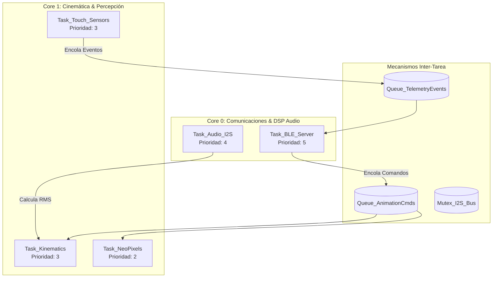

# Arquitectura Multitarea FreeRTOS (ESP32-S3 Dual Core)

Este documento detalla la distribución de cargas de trabajo, colas de mensajes (Queues), semáforos y afinidad de núcleos en **FreeRTOS** para la mascota interactiva.

---

## 🧠 1. Asignación de Tareas por Núcleo (Core Affinity)

---

## 📋 2. Detalle de las Tareas FreeRTOS

### Core 0 (Comunicaciones Inalámbricas & Procesamiento de Señal)

#### `Task_BLE_Server` (Prioridad: 5, Stack: 4096 bytes)
- **Función**: Servidor NimBLE / ESP-IDF BLE.
- **Responsabilidad**: Escucha comandos recibidos por la característica `...FA11`, valida la estructura del payload y los deposita en `Queue_AnimationCmds`. Procesa la cola `Queue_TelemetryEvents` para emitir notificaciones GATT `...FA12`.

#### `Task_Audio_I2S` (Prioridad: 4, Stack: 4096 bytes)
- **Función**: Manejador del driver I2S en lectura/escritura DMA.
- **Responsabilidad**: Lee muestras del micrófono INMP441, ejecuta el filtro paso alto y calcula el nivel RMS / dB(A). Cuando hay reproducción de voz, lee búferes PCM de la memoria PSRAM y los escribe en el DAC MAX98357A.

---

### Core 1 (Cinemática, Expresiones Visuales y Sensores Táctiles)

#### `Task_Kinematics` (Prioridad: 3, Stack: 3072 bytes)
- **Función**: Motor de interpolación de movimiento de servomotores.
- **Responsabilidad**: Lee la cola `Queue_AnimationCmds` y convierte los comandos (`HAPPY`, `LISTENING`) en trayectorias angulares continuas utilizando rampas de aceleración sinusoidal en 60 Hz.

#### `Task_NeoPixels` (Prioridad: 2, Stack: 2048 bytes)
- **Función**: Renderizado del bus RMT para tiras WS2812B.
- **Responsabilidad**: Genera las animaciones oculares a 60 FPS (pestañeo aleatorio, seguimiento con la mirada, cambio de color de iris) y la modulación de brillo del LED de corazón.

#### `Task_Touch_Sensors` (Prioridad: 3, Stack: 2048 bytes)
- **Función**: Muestreo de sensores capacitivos y ADC de batería.
- **Responsabilidad**: Escanea los 4 canales táctiles cada 20 ms. Aplica un filtro de ventana móvil y debounce. Si detecta un toque de duración > 100 ms, genera una estructura `TouchData_t` y la envía a `Queue_TelemetryEvents`.

---

## 🔒 3. Prevención de Condición de Carrera y Deadlocks

1. **Uso Exclusivo de Queues**: Las tareas no comparten variables globales mutables directas. Toda la comunicación entre tareas se realiza mediante colas por copia (`xQueueSend` / `xQueueReceive`).
2. **Mutex de Recursos**: El acceso a la flash/PSRAM para carga de efectos de audio se protege mediante `Mutex_AudioStorage`.
3. **Task Watchdog Timer (TWDT)**: Cada tarea periódica debe ejecutar `esp_task_wdt_reset()` al final de su bucle principal. El período del WDT está configurado en **3000 ms**.
