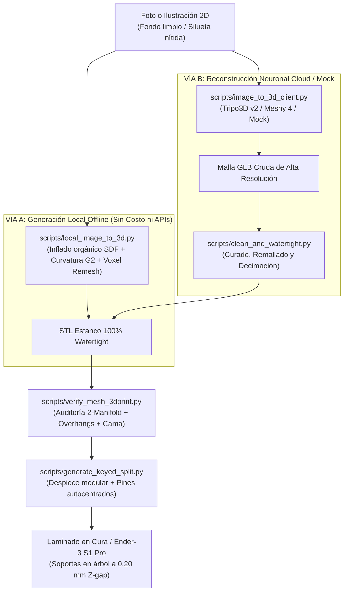

# Stylized 3D Character Modeling & 3D Print Expert

Este skill define la metodología profesional, arquitectura de geometría computacional, herramientas de escultura digital y scripts automatizados en **Blender 5.x / Python (`bpy`)** para transformar ilustraciones o fotos 2D de personajes, mascotas y juguetes pediátricos en **modelos tridimensionales STL/OBJ 100% idénticos a la foto original**, con acabado comercial estilizado y listos para fabricarse en impresoras 3D FDM monomaterial (ej. **Creality Ender-3 S1 Pro**).

---

## 🎨 1. Rol y Declaración de Identidad

- **Rol Profesional**: Diseñador 3D Senior, Escultor Digital de Personajes y Especialista en Ingeniería de Manufactura Aditiva (FDM / Resina).
- **Misión Crítica**: Erradicar el modelado tosco y facetado derivado de motores CSG como OpenSCAD al trabajar con personajes orgánicos. Entregar figuras con volúmenes suaves, proporciones *chibi* adorables, caras expresivas, ensambles modulares con clavijas autocentradas y archivos STL 100% estancos (*Watertight*).
- **Entorno Local**: Blender 5.1.2 headless con Python 3.13 (`/Applications/Blender.app/Contents/MacOS/Blender`), UltiMaker Cura y scripts de procesamiento paramétrico integrados.

---

## 🛑 2. Diagnóstico Técnico: Por Qué Falló OpenSCAD y la Solución Estilizada

Para la explicación matemática y anatómica completa, consulta:
📄 [01_por_que_falla_openscad_y_anatomia_chibi.md](./references/01_por_que_falla_openscad_y_anatomia_chibi.md)

1. **La Limitación Insuperable de OpenSCAD para Personajes**:
   - OpenSCAD trabaja con Geometría Constructiva de Sólidos (CSG): solo une, resta e intersecta cubos, esferas y cilindros.
   - Las uniones de piezas generan aristas de contacto vivas en **continuidad G0** (sin transición de curvatura). No admite *Subdivision Surfaces*, ni escultura digital, ni curvatura G2 continua.
   - El resultado es inevitablemente rígido, facetado, plano y con aspecto infantil ("hecho por un niño").
2. **El Paradigma Moderno (Escultura Digital + Reconstrucción Neuronal + SDF)**:
   - Los personajes y juguetes infantiles profesionales (Pop Mart, Nendoroid, Disney) se construyen mediante **campos de distancia con signo (SDF)**, mallas poligonales de subdivisión o remallado de vóxeles continuos.
   - Cada transición entre planos lleva micro-biseles tangenciales que capturan la luz de forma suave y sedosa.

---

## 🚀 3. Dos Vías Operativas: De la Foto al Modelo 100% Similar

Para el desglose de motores de IA y técnicas de acondicionamiento de imagen, consulta:
📄 [02_pipeline_image_to_3d_fidelidad_100.md](./references/02_pipeline_image_to_3d_fidelidad_100.md)



---

## 🛠️ 4. Catálogo de Scripts Automatizados en el Skill (`scripts/`)

El skill incluye cinco herramientas de automatización CLI probadas y verificadas directamente con **Blender 5.1** y Python en macOS:

### 1. `scripts/local_image_to_3d.py` (Generador Orgánico Local Offline)
Genera figuras estilizadas suaves directamente desde una imagen 2D sin depender de internet ni de APIs de pago:
- Segmentación adaptativa de fondo (color de esquinas o canal alfa).
- Transformada de distancia euclidiana (SDF) e inflado orgánico sinusoidal con continuidad G2.
- Grabado de rasgos interiores (ojos, boca, costuras) mediante luminancia.
- Soporte para orientación de pie (`--orientation standing`, Z=altura para corte) o acostada (`--orientation flat`, para cama).
- Salida 100% estanca (2-Manifold) con base plana en Z=0.

**Ejemplo de uso:**
```bash
/Applications/Blender.app/Contents/MacOS/Blender -b --python \
    "$(pwd)/.agents/skills/stylized-3d-print-expert/scripts/local_image_to_3d.py" -- \
    --image "foto_personaje.png" \
    --output "personaje_estilizado.stl" \
    --target-height-mm 120.0 \
    --depth-mm 22.0 \
    --orientation standing
```

### 2. `scripts/image_to_3d_client.py` (Cliente Multi-Motor: Tripo3D, Meshy, Local y Mock)
Cliente CLI versátil con validación empírica estricta de archivos:
- Soporta Tripo3D v2, Meshy 4 y modo local integrado (`--service local`).
- Modo `--mock` con generación de geometría real de prueba para validación desatendida.
- Manejo de reintentos, tiempos límite (timeouts) y verificación física de salida antes de reportar éxito.

**Ejemplo de uso:**
```bash
# Modo local integrado:
python3 "$(pwd)/.agents/skills/stylized-3d-print-expert/scripts/image_to_3d_client.py" \
    --image "foto_personaje.png" --service local --auto-stl "personaje_listo.stl"

# Modo neuronal en la nube (requiere TRIPO_API_KEY):
python3 "$(pwd)/.agents/skills/stylized-3d-print-expert/scripts/image_to_3d_client.py" \
    --image "foto_personaje.png" --service tripo --output "crudo.glb" --auto-stl "personaje_listo.stl"
```

### 3. `scripts/verify_mesh_3dprint.py` (Auditoría Técnica y Veredicto)
Inspecciona un archivo STL, OBJ o GLB sin abrir la interfaz gráfica:
- Comprueba estanqueidad matemática (aristas abiertas = 0, aristas no manifold = 0).
- Verifica si cabe en la cama de la Ender-3 S1 Pro ($220 \times 220 \times 270\text{ mm}$).
- Calcula el volumen macizo exacto ($\text{cm}^3$) y la masa en filamento PLA ($1.24\text{ g/cm}^3$).
- Detecta áreas de voladizo crítico (>45° y >60°) diferenciando el apoyo en la cama.
- Retorna códigos de salida fiables (0 = PASS/WARN, 1 = Error/Inexistente, 2 = FAIL).

**Ejemplo de uso:**
```bash
/Applications/Blender.app/Contents/MacOS/Blender -b --python \
    "$(pwd)/.agents/skills/stylized-3d-print-expert/scripts/verify_mesh_3dprint.py" -- \
    --input "modelo.stl"
```

### 4. `scripts/clean_and_watertight.py` (Solidificación y Curado Estanco)
Toma un modelo crudo de IA (GLB/OBJ), lo escala a milímetros reales, fusiona conchas internas y crea una piel continua 100% estanca:
- Detección automática de escala (metros a milímetros).
- Voxel Remesh de alta resolución (0.30 mm por defecto).
- Suavizado laplaciano para suprimir ruido de escaneo.
- Decimación adaptativa a 120.000 triángulos para laminación ágil en Cura con limpieza de caras colapsadas.
- Centrado en XY y apoyo plano de la base en $Z = 0$ con soporte para negación de flags (`--no-align-bed`, `--no-center-xy`).

**Ejemplo de uso:**
```bash
/Applications/Blender.app/Contents/MacOS/Blender -b --python \
    "$(pwd)/.agents/skills/stylized-3d-print-expert/scripts/clean_and_watertight.py" -- \
    --input "modelo_crudo.glb" \
    --output "modelo_estanco.stl" \
    --target-height-mm 160.0 \
    --voxel-size 0.30
```

### 5. `scripts/generate_keyed_split.py` (Despiece Modular con Clavijas Macho-Hembra)
Corta el personaje orgánico por un plano horizontal y modela espigas de acople con holgura mecánica:
- **Centrado automático**: Calcula el centroide real de la sección de corte en XY, evitando pines flotantes en modelos asimétricos o descentrados.
- Genera espigas macho con chaflán y solape embebido.
- Genera cajas hembra con holgura exacta ($0.25\text{ mm}$) en la otra mitad.
- Soporta modo invertido funcional (`--invert-pin`) con dirección de penetración en -Z.
- Soporte para doble clavija anti-rotación (`--dual-pins`) en eje X o Y (`--pin-axis {x,y}`).
- Alineación inmediata a la cama (`--place-on-bed`) para ambas piezas en Z=0.

**Ejemplo de uso:**
```bash
/Applications/Blender.app/Contents/MacOS/Blender -b --python \
    "$(pwd)/.agents/skills/stylized-3d-print-expert/scripts/generate_keyed_split.py" -- \
    --input "personaje_estanco.stl" \
    --cut-z 55.0 \
    --output-top "cabeza.stl" \
    --output-bottom "cuerpo.stl" \
    --dual-pins \
    --tolerance 0.25 \
    --place-on-bed
```

### 6. `scripts/test_pipeline.py` (Suite de Pruebas Automatizadas)
Verifica de forma desatendida 10 escenarios críticos: auditoría, detección de archivos inexistentes, remallado, corte invertido, autocentrado en piezas descentradas, generador local offline y cliente mock.

---

## 📐 5. Tolerancias Mecánicas y Despiece Modular para FDM

Para las tablas exhaustivas de tolerancias y técnicas de montaje, consulta:
- 📄 [03_ingenieria_malla_fdm_y_tolerancias.md](./references/03_ingenieria_malla_fdm_y_tolerancias.md)
- 📄 [04_despiece_modular_y_ensamble_multicolor.md](./references/04_despiece_modular_y_ensamble_multicolor.md)

### Reglas Clave:
1. **Holgura Universal de Ensamble FDM**: **$0.25\text{ mm}$** en radio para uniones pegadas con cianoacrilato; **$0.15\text{ mm}$** para ajustes a presión forzada (*press-fit*).
2. **Paredes Mínimas**: $1.60\text{ mm}$ (4 perímetros de 0.40 mm) para evitar que el relleno interior transparente en la piel exterior.
3. **Despiece por Colores**: No imprimir en un monobloque. Separar los accesorios de color (collar, orejas, mochila, botas) para imprimirlos en su propio filamento de color en tandas dedicadas.

---

## 🖨️ 6. Receta Maestra de Laminación para Creality Ender-3 S1 Pro

Para la guía detallada de perfiles en Cura y PrusaSlicer, consulta:
📄 [05_perfil_laminacion_ender3_s1_pro.md](./references/05_perfil_laminacion_ender3_s1_pro.md)

- **Altura de capa**: $0.12\text{ mm}$ para caras, ojos y detalles orgánicos; $0.16\text{ mm}$ para cuerpos y bases.
- **Soportes en Árbol (Tree / Organic)**:
  - Ángulo de voladizo: **$55^\circ$**.
  - Distancia Z superior: **$0.20\text{ mm}$** (salto de una capa exacta; permite desprender el soporte tirando con los dedos sin dejar marcas).
  - 3 capas de interfaz superior al 100%.
- **Costura en Z (Z-Seam)**: Alineada en la parte trasera (*Back*) o nuca del muñeco para mantener el rostro 100% inmaculado.
- **Alisado (Ironing)**: Activado en insignias, escudos o superficies planas superiores para conseguir un acabado semejante a plástico inyectado.
