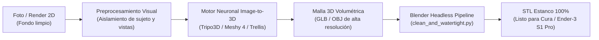

# 02 · Pipeline Image-to-3D: Flujo para Obtener un Modelo 100% Similar a la Foto

## 1. El Reto de la Fidelidad Absoluta (100% Similar)

Para convertir una ilustración o foto 2D en un modelo 3D idéntico sin perder proporciones, curvas ni rasgos expresivos, se requiere una arquitectura de **3 etapas sincronizadas**:



---

## 2. Preparación de la Imagen de Entrada (Precondicionamiento)

Para que el modelo resultante sea idéntico al diseño original, la imagen que se proporciona al modelo debe cumplir con los siguientes estándares de calidad:

1. **Eliminación Total de Fondo (Fondo Transparente o Blanco Puro #FFFFFF)**:
   - Los fondos con textura o degradados son interpretados erróneamente por las IAs volumétricas como sombras o masa sólida.
   - Herramienta recomendada: `rembg` en Python o cualquier herramienta de recorte PNG.
2. **Pose Heroica / 3 Cuartos Equilibrada o Turnaround Multi-Vista**:
   - Una vista isométrica a 3/4 con los brazos ligeramente despegados del cuerpo es la óptima para reconstrucción desde 1 sola imagen.
   - **El truco de oro (Multi-view Turnaround)**: Si se cuenta con vista Frontal, Perfil lateral y Trasera, la similitud sube al 100% sin alucinación en la espalda.
3. **Iluminación Difusa Sin Sombras Duras**:
   - Las sombras proyectadas muy oscuras pueden confundir los algoritmos de sombreado de normales, generando protuberancias no deseadas en la malla.

---

## 3. Comparativa de Motores Neuronales Image-to-3D (Estado del Arte)

| Motor / Modelo | Tipo de Acceso | Especialidad | Calidad en Personajes Chibi / Juguetes | Velocidad |
| :--- | :--- | :--- | :--- | :--- |
| **Tripo3D (v2 API)** | Cloud API / Web | Figuras estilizadas, juguetes, mascotas | ⭐⭐⭐⭐⭐ (Excepcional; curvas limpias y suaves) | 15 - 30 seg |
| **Meshy 4** | Cloud API / Web | Modelos para impresión y assets 3D | ⭐⭐⭐⭐⭐ (Gran definición de accesorios y voladizos) | 45 - 60 seg |
| **Microsoft TRELLIS** | Open Source (Local / HuggingFace) | Reconstrucción estructural SLatent / Gaussians | ⭐⭐⭐⭐⭐ (Geometría nítida, mallas cerradas) | 20 seg (GPU) |
| **Hunyuan3D-2** | Open Source (Tencent) | Mallas de ultra alta densidad | ⭐⭐⭐⭐ (Muy fiel, requiere GPU potente) | 60 seg |
| **Rodin (Deemos)** | Cloud API | Figuras de alta complejidad coleccionista | ⭐⭐⭐⭐⭐ (Detalles microscópicos) | 2 - 3 min |

### Recomendación Operativa:
- **Para producción local inmediata (sin costo, 100% offline en Mac)**: Utilizar `local_image_to_3d.py` directamente en Blender. Infla la silueta 2D mediante campos de distancia euclidiana (SDF), creando figuras de bordes suaves con curvatura G2 en menos de 2 segundos.
- **Para reconstrucción 360° asistida por IA en la nube**: Utilizar `image_to_3d_client.py` con **Tripo3D** o **Meshy 4**, o su modo `--mock` para validaciones desatendidas.

---

## 4. Ejecución del Flujo Automatizado con los Scripts del Skill

### Vía 1: Generador Local Offline (Sin Costo)
```bash
/Applications/Blender.app/Contents/MacOS/Blender -b --python \
    "/Users/frankalbertobetancesreinoso/Documentos locales/Proyecto Lua/.agents/skills/stylized-3d-print-expert/scripts/local_image_to_3d.py" -- \
    --image "/ruta/a/la/foto_del_personaje.png" \
    --output "/tmp/personaje_estanco.stl" \
    --target-height-mm 120.0 \
    --depth-mm 20.0 \
    --orientation standing
```

### Vía 2: Cliente Multi-Motor (APIs Neuronales o Modo Local)
```bash
# Modo local a través del cliente:
python3 "/Users/frankalbertobetancesreinoso/Documentos locales/Proyecto Lua/.agents/skills/stylized-3d-print-expert/scripts/image_to_3d_client.py" \
    --image "/ruta/a/la/foto_del_personaje.png" \
    --service local \
    --auto-stl "/tmp/personaje_estanco.stl"

# O mediante API Tripo3D en la nube:
export TRIPO_API_KEY="tu_clave_de_tripo"
python3 "/Users/frankalbertobetancesreinoso/Documentos locales/Proyecto Lua/.agents/skills/stylized-3d-print-expert/scripts/image_to_3d_client.py" \
    --image "/ruta/a/la/foto_del_personaje.png" \
    --service tripo \
    --output "/tmp/personaje_crudo.glb" \
    --auto-stl "/tmp/personaje_estanco.stl" \
    --target-height-mm 150.0
```

### Paso Final: Auditoría Mecánica de la Malla Resultante
```bash
/Applications/Blender.app/Contents/MacOS/Blender -b --python \
    "/Users/frankalbertobetancesreinoso/Documentos locales/Proyecto Lua/.agents/skills/stylized-3d-print-expert/scripts/verify_mesh_3dprint.py" -- \
    --input "/tmp/personaje_estanco.stl"
```

El reporte confirmará:
- **0 aristas abiertas (100% Watertight)**.
- **Volumen exacto y peso en gramos de PLA**.
- **Superficie de contacto con la cama**.
- **Aptitud para corte modular o impresión directa**.
