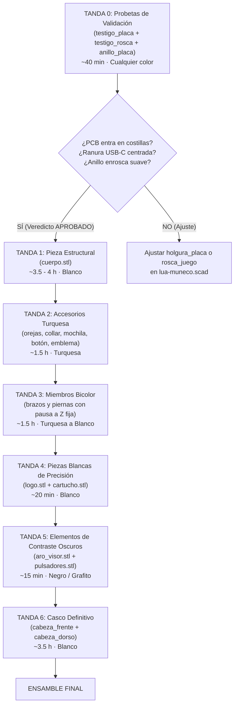

# Guía de Impresión 3D y Plan de Trabajo · Muñeco Lúa (Ender-3 S1 Pro)

> **Fecha:** 23/09/2026 · **Iteración:** V15 / Fase 3 USC (Oficial · 21 piezas)  
> **Impresora objetivo:** Creality Ender-3 S1 Pro (Cama 220 × 220 × 270 mm, boquilla 0,40 mm, monomaterial)  
> **Archivos STL locales:** [`stl/`](./stl/) (21 archivos STL verificados con el gate: sin agujeros, una cáscara, apoyados y dentro de la cama)  
> **Paquete comprimido para taller / servicio:** [`LUA_STL.zip`](./LUA_STL.zip)  
> **Fuente CAD paramétrica:** [`lua-firmware/cad/lua-muneco.scad`](./lua-firmware/cad/lua-muneco.scad)  
> **Renders de referencia:** [`lua-firmware/docs/cad/`](./lua-firmware/docs/cad/)

---

## 1. Novedades y Evolución del Modelo (Septiembre 2026)

El modelo actual representa la **maqueta oficial de la Fase 3 del plan de la USC** para evaluación pediátrica y validación clínica:
1. **Emblema Centrado en el Pecho (`emblema.stl`)**:
   - Originalmente situado en $x = -11\text{ mm}$, ahora se encuentra perfectamente alineado en el eje central ($x = 0$). El asiento en la curva esférica del pecho se adelantó $+1,9\text{ mm}$ para asegurar un asentamiento al ras sin hundimientos.
2. **Pastilla Icónica del Logo (`logo.stl` [NUEVO])**:
   - Resuelve el hueco interior del emblema con la silueta estilizada de Lúa en relieve blanco de alta definición (14,9 × 14,9 × 1,6 mm).
3. **Pulsadores bajo Barbilla (`pulsadores.stl` [NUEVO])**:
   - Embellecedor oscuro que protege e interactúa con los pulsadores físicos del canto de la placa de desarrollo (`REST` y `BOOT`) a través de la ranura de carga. *Nota: se imprime una vez contrastadas las cotas con calibre*.
4. **Sujeción de PCB por Rosca Positiva (`anillo_placa.stl`)**:
   - Rosca trapecial Ø55 mm M55 integrada en `cabeza_frente.stl`. Sujeta firmemente la pantalla y placa absorbiendo espesores entre 8,0 mm y 16,0 mm sin requerir espuma adhesiva.
5. **Alineación del Casco por bayoneta (`cabeza_dorso.stl`)** (x1):
   - 3 nervios helicoidales asimétricos sustituyen a las 2 espigas: se presenta, se gira un cuarto de vuelta y solo cierra en una orientación. Sin pegamento.
6. **Túnel de Carga USB-C Despejado**:
   - Ranura de 16 mm bajo la barbilla y muesca pasante en `collar.stl` para conectar el cable de carga USB-C sin desmontar la figura.
7. **Probetas de Verificación Rápida (`testigo_placa.stl` y `testigo_rosca.stl`)**:
   - Dos piezas breves (~35 min de impresión combinada) que resuelven las tolerancias de PCB y rosca antes de lanzar las piezas de 4 horas.

---

## 2. Catálogo Oficial de los 21 Archivos STL

Todos los archivos han sido verificados matemáticamente mediante el gate [`tools/check-cad.js`](./lua-firmware/tools/check-cad.js): **sin agujeros, una sola cáscara (salvo virutas internas de teselación avisadas), apoyo en Z = 0 y dentro de la cama 220 × 220 mm con 5 mm de margen**.

| Archivo STL | Cant. | Color sugerido | Huella X × Y × Z (mm) | Vol. Macizo | Función y Rol en el Ensamble |
| :--- | :---: | :--- | :---: | :---: | :--- |
| **`testigo_placa.stl`** | 1 | Cualquier color | 49.5 × 51.0 × 8.0 | 3.0 cm³ | **Probeta 1 (Calibración):** Valida contorno de PCB y ranura USB-C. |
| **`testigo_rosca.stl`** | 1 | Cualquier color | 61.0 × 61.0 × 12.0 | 5.3 cm³ | **Probeta 2 (Calibración):** Barril roscado M55 (*imprimir con balsa*). |
| **`anillo_placa.stl`** | 1 | Blanco / Libre | 64.3 × 64.3 × 11.0 | 8.3 cm³ | **Retención de PCB:** Se enrosca tras la placa dentro de la cabeza. |
| **`cuerpo.stl`** | 1 | Blanco | 75.4 × 65.5 × 80.0 | 164.3 cm³ | Tronco principal. Compartimento para batería y encajes de miembros. |
| **`cabeza_frente.stl`** | 1 | Blanco | 84.4 × 84.5 × 25.9 | 27.6 cm³ | Cara frontal, visor circular y rosca M55. Con espolón de bayoneta. |
| **`cabeza_dorso.stl`** | 1 | Blanco | 87.0 × 85.5 × 53.8 | 34.9 cm³ | Cúpula con respiraderos y manga de bayoneta (*brim 5 mm*). |
| **`brazo_izq.stl`** | 1 | Blanco + Turquesa | 20.0 × 19.0 × 39.4 | 7.1 cm³ | Brazo izquierdo vertical. Puño turquesa hasta Z=16.5 mm. |
| **`brazo_der.stl`** | 1 | Blanco + Turquesa | 20.0 × 19.0 × 39.4 | 7.1 cm³ | Brazo derecho vertical. Puño turquesa hasta Z=16.5 mm. |
| **`pierna_izq.stl`** | 1 | Blanco + Turquesa | 28.3 × 23.7 × 34.5 | 11.4 cm³ | Pierna izquierda vertical. Bota turquesa hasta Z=14.0 mm. |
| **`pierna_der.stl`** | 1 | Blanco + Turquesa | 28.3 × 23.7 × 34.5 | 11.4 cm³ | Pierna derecha vertical. Bota turquesa hasta Z=14.0 mm. |
| **`oreja_izq.stl`** | 1 | Turquesa | 30.0 × 27.3 × 12.0 | 2.7 cm³ | Oreja izquierda con bayoneta de 1/4 de vuelta (con balsa). |
| **`oreja_der.stl`** | 1 | Turquesa | 30.0 × 27.3 × 12.0 | 2.7 cm³ | Oreja derecha con bayoneta de 1/4 de vuelta (con balsa). |
| **`collar.stl`** | 1 | Turquesa | 34.4 × 36.6 × 8.4 | 3.0 cm³ | Anillo del cuello con muesca para USB-C hacia el frente. |
| **`mochila.stl`** | 1 | Turquesa | 48.0 × 36.0 × 10.4 | 14.6 cm³ | Tapa trasera sobre 2 pernos sueltos (sin tornillos). |
| **`pernos_mochila.stl`** | 1 | Blanco / Libre | 20.6 × 4.0 × 4.0 | 0.2 cm³ | **[NUEVO x1]** Los 2 pernos sueltos Ø4 (salen de una pieza con lengüeta rompible). |
| **`boton.stl`** | 1 | Turquesa | 15.0 × 15.0 × 3.4 | 0.5 cm³ | Detalle estético pegado en la sien derecha. |
| **`emblema.stl`** | 1 | Turquesa | 22.0 × 22.0 × 2.4 | 0.6 cm³ | Aro exterior del escudo centrado en el pecho. Aloja `logo.stl`. |
| **`logo.stl`** | 1 | Blanco | 14.9 × 14.9 × 1.6 | 0.3 cm³ | **[NUEVO]** Silueta de Lúa pegada dentro del emblema. |
| **`cartucho.stl`** | 1 | Blanco / Libre | 33.2 × 9.2 × 23.2 | 2.5 cm³ | Cuna interior para sujetar la celda de litio con cinta doble cara. |
| **`aro_visor.stl`** | 1 | Oscuro / Negro | 44.0 × 44.0 × 1.6 | 0.9 cm³ | Marco circular del visor que enmarca la pantalla IPS. |
| **`pulsadores.stl`** | 1 | Oscuro / Negro | 28.3 × 14.3 × 18.6 | 0.9 cm³ | Guía de botones bajo barbilla (con soportes de árbol). |

---

## 3. Plan de Impresión por Tandas Inteligentes

Diseñado para optimizar cambios de filamento y garantizar el éxito mecánico sin desperdiciar tiempo ni material:

```mermaid
graph TD
    T0["TANDA 0: Probetas de Validación<br>(testigo_placa + testigo_rosca + anillo_placa)<br>~40 min · Cualquier color"]
    T0 --> CHECK{"¿PCB entra en costillas?<br>¿Ranura USB-C centrada?<br>¿Anillo enrosca suave?"}
    
    CHECK -- SÍ (Veredicto APROBADO) --> T1["TANDA 1: Pieza Estructural<br>(cuerpo.stl)<br>~3.5 - 4 h · Blanco"]
    CHECK -- NO (Ajuste) --> SCAD["Ajustar holgura_placa o rosca_juego<br>en lua-muneco.scad"]
    
    T1 --> T2["TANDA 2: Accesorios Turquesa<br>(orejas, collar, mochila, botón, emblema)<br>~1.5 h · Turquesa"]
    T2 --> T3["TANDA 3: Miembros Bicolor<br>(brazos y piernas con pausa a Z fija)<br>~1.5 h · Turquesa a Blanco"]
    T3 --> T4["TANDA 4: Piezas Blancas de Precisión<br>(logo.stl + cartucho.stl)<br>~20 min · Blanco"]
    T4 --> T5["TANDA 5: Elementos de Contraste Oscuros<br>(aro_visor.stl + pulsadores.stl)<br>~15 min · Negro / Grafito"]
    T5 --> T6["TANDA 6: Casco Definitivo<br>(cabeza_frente + cabeza_dorso)<br>~3.5 h · Blanco"]
    T6 --> ENSAMBLE["ENSAMBLE FINAL"]
```

### Detalle Operativo de Cada Tanda:

1. **Tanda 0 · Calibración previa (~40 min · Cualquier filamento)**:
   - Piezas: `testigo_placa.stl`, `testigo_rosca.stl` y `anillo_placa.stl`.
   - **Regla crítica:** `testigo_rosca` debe laminarse obligatoriamente con **balsa (raft)** de 2 capas para asegurar estabilidad.
   - Presentar la placa electrónica en `testigo_placa` y enroscar el anillo en el barril para verificar ajuste suave.
2. **Tanda 1 · Tronco Principal (~3 h 50 min · Blanco PLA)**:
   - Pieza: `cuerpo.stl`.
   - No depende de la placa. Puede imprimirse mientras se revisa la electrónica.
3. **Tanda 2 · Accesorios Turquesa (~1 h 30 min · Turquesa PLA)**:
   - Piezas: `oreja_izq.stl`, `oreja_der.stl`, `collar.stl`, `mochila.stl`, `boton.stl`, `emblema.stl`.
   - Orientación plana en Z = 0 tal como vienen orientadas.
4. **Tanda 3 · Extremidades Bicolor con Cambio en Z (~1 h 30 min)**:
   - Piezas: `brazo_izq.stl`, `brazo_der.stl`, `pierna_izq.stl`, `pierna_der.stl`.
   - **Brazos:** Iniciar en **Turquesa** $\rightarrow$ Pausa (`M600`) o cambio de filamento a **Blanco** a los **16,5 mm** de altura Z.
   - **Piernas:** Iniciar en **Turquesa** $\rightarrow$ Pausa (`M600`) o cambio de filamento a **Blanco** a los **14,0 mm** de altura Z.
5. **Tanda 4 · Piezas Blancas de Detalle (~20 min · Blanco PLA)**:
   - Piezas: `logo.stl` y `cartucho.stl`.
   - Para `logo.stl` se recomienda altura de capa reducida (0,12 mm - 0,16 mm) o activación de *Ironing* (alisado superficial) para máxima nitidez del relieve.
6. **Tanda 5 · Contraste Oscuro (~15 min · Negro / Gris grafito)**:
   - Piezas: `aro_visor.stl` (y opcionalmente `pulsadores.stl` si la placa física coincide con el plano).
7. **Tanda 6 · Casco Definitivo (~3 h 40 min · Blanco PLA)**:
   - Piezas: `cabeza_frente.stl` y `cabeza_dorso.stl`.
   - `cabeza_dorso` requiere **Brim de 5 mm** para garantizar anclaje a la cama.

---

## 4. Parámetros Maestros de Laminación (Cura / PrusaSlicer)

- **Boquilla:** 0,40 mm
- **Altura de capa estándar:** 0,20 mm
- **Perímetros / Paredes:** 3 (1,2 mm) a 4 líneas (1,6 mm)
- **Capas superiores / inferiores:** 4 / 4
- **Relleno:** 12% a 15% Patrón **Giroide** (*Gyroid*)
- **Soportes:** en árbol solo donde el gate los pide: `oreja_izq`/`oreja_der` (31,8 % de voladizo, bajo el vástago), `pulsadores` (30,3 %) y `anillo_placa` (17,9 %). El resto sale sin soportes.
- **Temperatura:** 205 °C - 215 °C (Nozzle) / 60 °C (Cama PEI).
- **Costura en Z (Z-Seam):** Alinear en la parte trasera (`Back` / Nuca) para preservar la cara frontal totalmente limpia.

---

## 5. Lista de Materiales y Tornillería (BOM)

1. **Filamentos PLA 1,75 mm:**
   - PLA Blanco: ~280 g.
   - PLA Turquesa / Cyan: ~70 g.
   - PLA Negro / Grafito: ~10 g.
2. **Ferretería:** ninguna desde x1 (sin tornillos ni insertos).
3. **Adhesivo:**
   - Cianoacrilato de viscosidad media solo para `aro_visor`, `boton` y `logo` (piezas pequeñas vistas). Nada estructural lleva pegamento.
   - Cinta de espuma de doble cara para fijar la celda de litio al `cartucho.stl`.

---

## 6. Procedimiento Paso a Paso de Ensamble

1. **Preparación de la Espalda:**
   - Clavar a presión los 2 `pernos_mochila.stl` en los taladros dorsales del `cuerpo.stl` (3,0 mm dentro, pico guía por delante).
2. **Collarín:**
   - Deslizar `collar.stl` en el cuello del `cuerpo.stl` con la muesca apuntando al frente **antes de montar la cabeza**.
3. **Montaje de la Electrónica:**
   - Introducir la placa con pantalla circular en `cabeza_frente.stl`.
   - Roscar `anillo_placa.stl` en el barril M55 con los dedos hasta que haga tope firme contra la placa.
4. **Cierre de la Cabeza:**
   - Presentar los 3 nervios del espolón en sus canales y girar un cuarto de vuelta hasta juntar las caras. Sin pegamento.
   - Encajar las dos mitades (la asimetría solo deja cerrar en una orientación: orejas a plomo).
5. **Accesorios:**
   - Presentar cada oreja en su cajera y girar un cuarto de vuelta (brida + cono). Sin pegamento; izquierda y derecha no intercambiables.
   - Pegar `boton.stl` en la sien derecha.
   - Pegar `aro_visor.stl` alrededor de la pantalla.
   - Insertar y pegar `logo.stl` dentro del `emblema.stl`, y luego empujar el conjunto a presión centrado en el pecho.
6. **Batería y Miembros:**
   - Fijar la celda en `cartucho.stl`, pasar los cables MX1.25 y cerrar la mochila empujándola sobre los 2 pernos (sin tornillos; abre tirando: valorar con riesgo clínico).
   - Empujar a presión las espigas de brazos y piernas en sus cajeras del tronco (sin pegamento).
