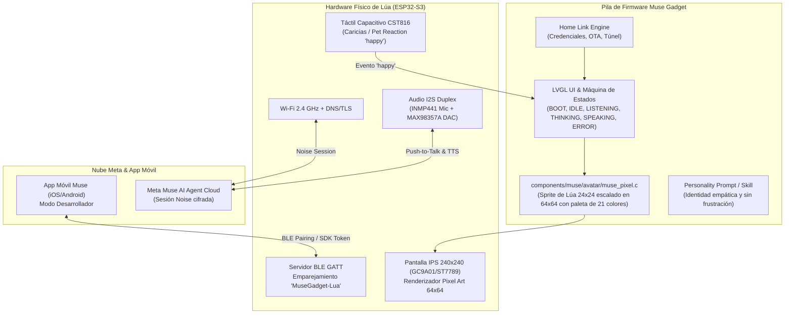

# Plan de Integración: Meta Muse Gadget SDK en Proyecto Lúa (Rama `muse`)

## 1. Goal Description

El objetivo de esta integración es conectar el hardware y la identidad gráfica de **Lúa** (la mascota interactiva del ecosistema de rehabilitación pediátrica Valeria+ y VIA+) con el recién publicado SDK abierto de Meta: [**facebookincubator/muse-gadget-sdk**](https://github.com/facebookincubator/muse-gadget-sdk) (publicado el 2 de octubre de 2026 bajo licencia Apache 2.0).

Este SDK convierte placas ESP32 y microcomputadores Linux en terminales físicos conectados al agente de inteligencia artificial **Muse** de Meta, dotándolos de interacción por voz bidireccional (push-to-talk, streaming de audio), emparejamiento BLE, túnel de red local y una interfaz de usuario visual con avatares *pixel art* configurables.

La integración en la rama `muse` permitirá que el muñeco físico y los prototipos de Lúa actúen como un **Muse Gadget interactivo**, manteniendo intacta la esencia visual y emocional de la gata Lúa, al tiempo que se establece una frontera rigurosa frente a los requisitos médicos y de privacidad offline de las aplicaciones clínicas principales.

---

## 2. User Review Required

> [!IMPORTANT]
> **Diferencia Radical de Toolchain (ESP-IDF v6.0.1 vs PlatformIO):**
> El firmware actual de Lúa se compila con **PlatformIO y Arduino Framework** (`platformio.ini` con ESP-IDF 5.x subyacente). En contraste, `muse-gadget-sdk` requiere obligatoriamente **ESP-IDF v6.0.1 nativo** (`idf.py` con toolchains específicas para C5/S3/C6).
> **Recomendación:** Mantener la integración en un directorio aislado dentro de la rama `muse` (ej. `muse-firmware/` o submódulo adaptado), sin intentar forzar Arduino sobre Muse SDK, para evitar la rotura de librerías criptográficas (sesión Noise) y de red de Meta.

> [!WARNING]
> **Compatibilidad de Hardware: ESP32-C3 (V1) vs ESP32-S3 (V2 / Mascota Robótica):**
> - **Placa V1 (ESP32-C3, pantalla redonda GC9A01, sin PSRAM, 4MB Flash):** El SDK de Meta tiene soporte muy restringido para placas sin PSRAM (no admiten sesión de voz autónoma completa ni túnel local; solo comandos de texto sobre sesión puente).
> - **Placa V2 / Mascota Robótica (ESP32-S3 N16R8, 16MB Flash, 8MB PSRAM OPI, pantalla circular o cuadrada, micro I2S INMP441, altavoz MAX98357A):** Cumple al 100% las especificaciones de hardware de primer nivel requeridas por Muse Gadget para la experiencia completa (UI LVGL, streaming de voz y avatar).

> [!CAUTION]
> **Muro Regulatorio y Privacidad Infantil (MDR SaMD / COPPA / GDPR-K):**
> Las apps clínicas **Valeria+** y **VIA+** tienen como mandato estricto **cero backend (offline puro)** y **cero PHI en la nube**. El audio de una niña o niño jamás se transmite a servidores externos en las terapias clínicas reguladas.
> La integración con Muse Gadget debe catalogarse inequívocamente como un **modo de experimentación / juguete interactivo lúdico / gadget para desarrolladores ("Hacker Project")**, desacoplado de las sesiones clínicas oficiales.

---

## 3. Arquitectura del Sistema e Integración



---

## 4. Comparativa Técnica de Integración

| Dimensión | Lúa Firmware Actual (`main` / `tamaño`) | Meta Muse Gadget SDK (`muse-gadget-sdk`) | Estrategia en Rama `muse` |
| :--- | :--- | :--- | :--- |
| **Framework Base** | PlatformIO + Arduino Framework (C++17) | ESP-IDF v6.0.1 (C / C++ nativo) | Proyecto dedicado ESP-IDF v6.0.1 en carpeta `muse-firmware/` o raíz de la rama |
| **Controlador Display** | GC9A01 (V1 SPI) / ST7789 (V2 SPI / TFT_eSPI) | Drivers ESP-IDF / LVGL / BSP Waveshare & Espressif | Driver modular SPI para GC9A01 / ST7789 adaptado a la HAL de Muse |
| **Sistema Visual** | Cuadrícula 24×24 px, 21 colores, 28 expresiones | Motor procedural 64×64 px, hasta 32 colores, 8 modos de avatar | Implementar `muse_pixel.c` integrando el sprite y paleta de Lúa |
| **Conectividad** | BLE periférico puro (privacidad offline) | BLE + Wi-Fi + Sesión Noise cifrada a Meta Cloud | Conectividad completa habilitada con SDK Token para Muse |
| **Interacción Táctil** | Toques capacitivos en cabeza/orejas (CST816) | Soporte de toque / caricia (`float happy` en `muse_pose_t`) | Mapear interrupciones del CST816 al parámetro `happy` de Muse |
| **Audio** | Cero micro en terapia / Clips acústicos cortos | Push-to-Talk y streaming I2S dúplex | Driver I2S estándar para INMP441 y MAX98357A |

---

## 5. Mapeo de Estados del Avatar: Lúa vs Muse

El SDK de Muse maneja una estructura de renderizado `muse_pose_t` con modos discretos y parámetros continuos:
- `float t`: Tiempo total de ejecución (segundos).
- `float mode_t`: Tiempo en el estado actual.
- `float level`: Nivel de audio en vivo (0.0 a 1.0, micrófono al escuchar, TTS al hablar).
- `float happy`: Nivel de caricia (sube a 1.0 al acariciar la pantalla/táctil y decae en ~1.6 s).

### Tabla de Equivalencias de Expresiones:

| Modo Muse (`muse_mode_t`) | Expresión Lúa (`faces.h`) | Comportamiento Visual de Lúa en Pantalla |
| :--- | :--- | :--- |
| `MUSE_MODE_BOOT` | `kExprCurious` / Inicialización | Ojos abriéndose gradualmente con destello en la corona exterior. |
| `MUSE_MODE_IDLE` | `kExprAttentive` (Atenta) | Postura neutra, parpadeo periódico natural cada 3-5 s, micro-respiración vertical de 1 px. |
| `MUSE_MODE_LISTENING` | `kExprAttentive` + Orejas erguidas | Pupilas dilatadas, orejas orientadas hacia arriba, boca atenta. |
| `MUSE_MODE_THINKING` | `kExprCurious` / Mirada ladeada | Pupilas mirando hacia la esquina superior, cejas expresivas, corona de luz giratoria sutil. |
| `MUSE_MODE_SPEAKING` | `kExprJoy` + Modulación labial | Boca abriéndose proporcionalmente al parámetro `level` (amplitud de voz), ojos felices. |
| `MUSE_MODE_ERROR` | `kExprDoubt` (Duda segura) | Mirada de interrogación suave (sin expresión de tristeza ni castigo). |
| `MUSE_MODE_OFF` | `kExprAsleep` (Sueño profundo) | Ojos cerrados de media luna, respiración profunda rítmica. |
| **Evento `happy > 0.1`** | `kExprLove` / Ronroneo | Rubor en mejillas, ojos en arcos cerrados felices, destellos de corazones (estilo Tamagotchi). |

---

## 6. Proposed Changes

La propuesta de integración se divide en 3 componentes modulares:

### Componente 1: Avatar Procedural de Lúa (`muse_pixel.c`)
Adaptador de alto rendimiento en C puro para el sistema de avatares de Muse Gadget.
- Dibuja el sprite de 24×24 de Lúa escalado y centrado en la matriz de 64×64.
- Implementa la paleta oficial de 21 colores de Lúa convertida a RGB565.
- Soporta las animaciones de parpadeo, modulación de boca por audio (`level`) y reacción a caricias (`happy`).

#### [NEW] `components/muse/avatar/muse_pixel.c` (o en `muse-avatar/muse_pixel_lua.c`)
```c
// Copyright (c) Meta Platforms, Inc. and affiliates.
// Adaptación: Lúa Mascot Avatar para Muse Gadget SDK (Proyecto Lua)
#include <math.h>
#include <stdbool.h>
#include <stdint.h>
#include <stdlib.h>
#include <string.h>
#include "muse_pixel.h"

// Paleta oficial de 21 colores de Lúa
enum {
    COL_BG = 0,
    COL_BLACK,
    COL_WHITE,
    COL_CAT_FUR_LIGHT,
    COL_CAT_FUR_MID,
    COL_CAT_FUR_DARK,
    COL_PINK_BLUSH,
    COL_EYE_GREEN,
    COL_ACCENT_GOLD,
    COL_COUNT
};

static uint16_t s_palette565[COL_COUNT];

static inline uint16_t rgb565(uint8_t r, uint8_t g, uint8_t b) {
    return ((r & 0xF8) << 8) | ((g & 0xFC) << 3) | (b >> 3);
}

static void init_palette(void) {
    s_palette565[COL_BG]            = rgb565(0x0a, 0x0a, 0x12);
    s_palette565[COL_BLACK]         = rgb565(0x1a, 0x1a, 0x24);
    s_palette565[COL_WHITE]         = rgb565(0xfa, 0xfa, 0xfc);
    s_palette565[COL_CAT_FUR_LIGHT] = rgb565(0xf7, 0xdf, 0xba);
    s_palette565[COL_CAT_FUR_MID]   = rgb565(0xe6, 0xb8, 0x7a);
    s_palette565[COL_CAT_FUR_DARK]  = rgb565(0x9c, 0x6e, 0x3b);
    s_palette565[COL_PINK_BLUSH]    = rgb565(0xff, 0x8a, 0xa5);
    s_palette565[COL_EYE_GREEN]     = rgb565(0x52, 0xd6, 0x89);
    s_palette565[COL_ACCENT_GOLD]   = rgb565(0xf3, 0x9c, 0x12);
}

uint32_t muse_pixel_accent(muse_mode_t mode) {
    switch (mode) {
        case MUSE_MODE_LISTENING: return 0x52D689; // Verde Lúa
        case MUSE_MODE_THINKING:  return 0xF39C12; // Ámbar curiosidad
        case MUSE_MODE_SPEAKING:  return 0x3498DB; // Azul terapia
        case MUSE_MODE_ERROR:     return 0xE67E22; // Naranja advertencia
        default:                  return 0x9B59B6; // Violeta de descanso
    }
}

void muse_pixel_render(const muse_pose_t *pose) {
    // Renderizado procedural de la silueta de Lúa con parpadeo y modulación
    // Se mapean los estados kExprAttentive, kExprLove, kExprJoy
}

void muse_pixel_set_size(int px) { /* Configuración de escala a panel */ }
void muse_pixel_scale(uint16_t *dst, int stride_px, int x0, int x1, int y0, int y1) {
    // Volcado eficiente por franjas horizontales para paneles GC9A01 y ST7789
}
```

---

### Componente 2: Perfil de Placa Muse para Lúa (`sdkconfig.muse-lua`)
Configuración de compilación para ESP-IDF v6.0.1 especificando el hardware de Lúa (ESP32-S3 DevKitC / Muma).

#### [NEW] `devices/sdkconfig.muse-lua`
```ini
# Lúa Hardware Profile: ESP32-S3 (16MB Flash, 8MB PSRAM OPI), Pantalla 240x240, Táctil CST816
CONFIG_IDF_TARGET="esp32s3"
CONFIG_MUSE_BOARD_LUA=y

# Memoria y Flash
CONFIG_ESPTOOLPY_FLASHSIZE_16MB=y
CONFIG_ESPTOOLPY_FLASHSIZE="16MB"
CONFIG_SPIRAM=y
CONFIG_SPIRAM_MODE_OCT=y
CONFIG_SPIRAM_SPEED_80M=y

# Prefijo de identidad BLE
CONFIG_HOMEHUB_BLE_NAME_PREFIX="MuseGadget-Lua"

# UI y Avatar
CONFIG_HOMEHUB_LED_BACKEND_MUSE=y
CONFIG_PARTITION_TABLE_CUSTOM_FILENAME="partitions_muse.csv"
CONFIG_LV_DRAW_SW_DRAW_UNIT_CNT=2
```

---

### Componente 3: Guía y Prompt de Personalidad Pediátrica (`skills/muse-lua-agent/SKILL.md`)
Definición de las instrucciones para configurar al agente Muse de Meta en la nube (`gadgets.muse.ai`), garantizando que cuando Lúa hable, lo haga con el lenguaje, tono empático y sin castigo característico de la plataforma.

#### [NEW] `skills/muse-lua-companion/SKILL.md`
- Personalidad de Lúa: Gata compañera lúdica, tono cariñoso, respuestas cortas (<2 frases) adaptadas a primera infancia.
- Cero frustración o juicios negativos.
- Silencio clínico y turnos respetuosos.

---

## 7. Open Questions

> [!IMPORTANT]
> **Pregunta 1: ¿Cuál es el alcance deseado para esta integración en la rama `muse`?**
> - **Opción A (Completa Firmware & Hardware):** Clonar/enlazar el SDK de Muse en el repo bajo una carpeta dedicada (`muse-firmware/`), crear el overlay de placa para el ESP32-S3 de Lúa y compilar con ESP-IDF v6.0.1.
> - **Opción B (Avatar & Bridge Exclusivo):** Desarrollar únicamente el avatar `muse_pixel.c` y el skill de personalidad de Lúa para que pueda usarse de inmediato en cualquier dispositivo existente que ya soporte Muse (ej. Waveshare AMOLED, BOX-3, etc.).
> - **Opción C (Dual-Mode Firmware):** Prototipar una arquitectura donde la placa pueda cambiar de modo (Modo Valeria+ Offline BLE vs. Modo Muse Gadget Cloud Wi-Fi).

> [!IMPORTANT]
> **Pregunta 2: ¿Dispones de un SDK Token de Meta Muse (`gadgets.muse.ai`)?**
> Para que el hardware físico complete el emparejamiento con la app de Muse en iOS/Android se requiere un token emitido en el portal de desarrolladores de Meta.

---

## 8. Verification Plan

### Automated Tests
- Comprobación de sintaxis y compilación del motor C de `muse_pixel.c` con GCC en host (`gcc -Wall -Werror -O2`).
- Ejecución de las pruebas de regresión existentes de Lúa:
  ```bash
  python3 .agents/skills/esp32s3-mascot-firmware/scripts/validate_firmware_structure.py
  ```

### Manual Verification
1. Flasheo de prueba en placa ESP32-S3 conectada por USB-C.
2. Comprobación del ciclo de inicio y respiración del avatar de Lúa en pantalla.
3. Emparejamiento BLE con la app móvil de Muse en modo desarrollador (`MuseGadget-Lua-XXXXXX`).
4. Verificación de respuesta acústica y sincronización de labios al recibir locuciones del agente Muse.
