# 🤖 LÚA — Manual de Ensamble
### Mascota Robótica · Valeria+ / VIA+ · V14 · Sept 2026

---

---

## 📦 Materiales necesarios antes de empezar

| Herramienta | Qué hacer con ella |
|---|---|
| 🔧 Soldador de punta fina | Instalar insertos de latón M2 |
| 🧴 Cianoacrilato (Super Glue) | Pegar casco, orejas, botón, emblema |
| 🔩 Destornillador cruceta M2 | Fijar la mochila |
| 📏 Cinta de espuma de doble cara | Sujetar la batería al cartucho |

---

## 🗂️ Inventario de Piezas (20 piezas)

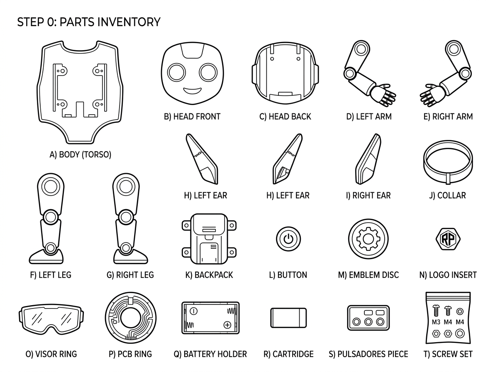

| # | Pieza | Archivo | Color | Cant. |
|:---:|---|---|:---:|:---:|
| A | **Cuerpo** (tronco) | `cuerpo.stl` | ⬜ Blanco | 1 |
| B | **Cabeza frontal** (visor) | `cabeza_frente.stl` | ⬜ Blanco | 1 |
| C | **Cabeza dorso** (cúpula) | `cabeza_dorso.stl` | ⬜ Blanco | 1 |
| D | **Brazo izquierdo** | `brazo_izq.stl` | ⬜/🟦 Bicolor | 1 |
| E | **Brazo derecho** | `brazo_der.stl` | ⬜/🟦 Bicolor | 1 |
| F | **Pierna izquierda** | `pierna_izq.stl` | ⬜/🟦 Bicolor | 1 |
| G | **Pierna derecha** | `pierna_der.stl` | ⬜/🟦 Bicolor | 1 |
| H | **Oreja izquierda** | `oreja_izq.stl` | 🟦 Turquesa | 1 |
| I | **Oreja derecha** | `oreja_der.stl` | 🟦 Turquesa | 1 |
| J | **Collar** (cuello) | `collar.stl` | 🟦 Turquesa | 1 |
| K | **Mochila** (tapa trasera) | `mochila.stl` | 🟦 Turquesa | 1 |
| L | **Botón** (sien derecha) | `boton.stl` | 🟦 Turquesa | 1 |
| M | **Emblema** (aro pecho) | `emblema.stl` | 🟦 Turquesa | 1 |
| N | **Logo** (silueta Lúa) | `logo.stl` | ⬜ Blanco | 1 |
| O | **Aro visor** | `aro_visor.stl` | ⬛ Negro | 1 |
| P | **Anillo de placa** | `anillo_placa.stl` | ⬜ Blanco | 1 |
| Q | **Cartucho batería** | `cartucho.stl` | ⬜ Blanco | 1 |
| R | **Pulsadores** (barbilla) | `pulsadores.stl` | ⬛ Negro | 1 |
| S | **Insertos latón M2** | — | 🟡 Latón | 2 |
| T | **Tornillos M2 × 8 mm** | — | 🩶 Acero | 2 |

---

> **Vista de todas las piezas separadas** — Referencia visual del modelo 3D antes del ensamble.

---

## 🔨 Proceso de Ensamble

---

### PASO 1 · Insertos de calor en el cuerpo

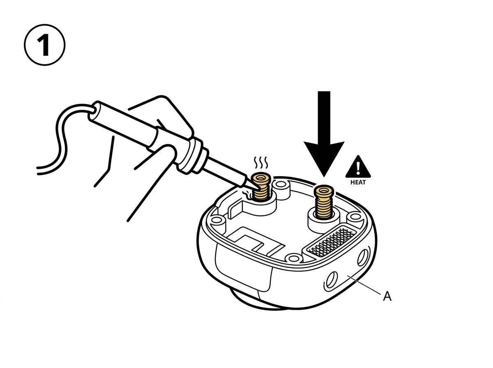

> ⚠️ **CALOR** — El soldador estará a ~200 °C. No tocar la punta. No forzar el inserto; debe hundirse suavemente con el calor residual.

- Calienta el soldador.
- Coloca el `cuerpo.stl` boca abajo sobre una superficie plana.
- Apoya un **inserto de latón M2** sobre cada una de las **2 cajeras dorsales** (orificios en la espalda).
- Presiona suavemente con la punta del soldador hasta que el inserto quede al ras o ligeramente hundido.
- Repite con el segundo inserto.
- Deja enfriar **2 minutos** antes de continuar.

---

### PASO 2 · Deslizar el collar al cuello

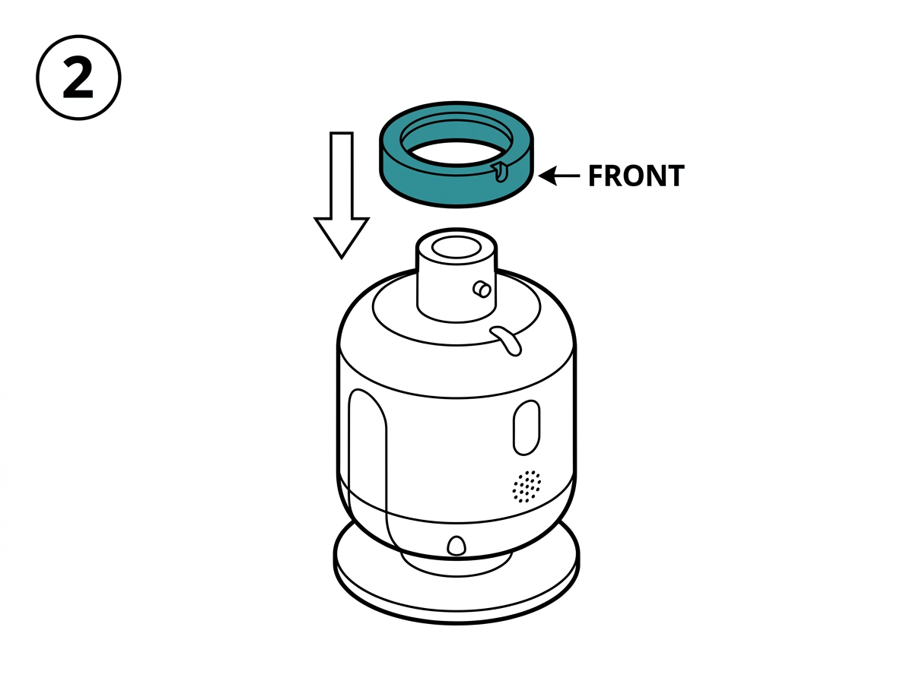

> ⚠️ **HAZ ESTO ANTES DE PEGAR LA CABEZA.** Una vez el casco esté pegado, ya no podrás insertar el collar desde arriba.

- Toma el `collar.stl` (anillo turquesa).
- Localiza la **muesca / ranura** en el interior del collar.
- Desliza el collar por el cuello del `cuerpo.stl` con la **muesca apuntando hacia el frente**.
- No uses pegamento aquí; el collar debe quedar libre.

---

### PASO 3 · Montar la electrónica en la cabeza frontal

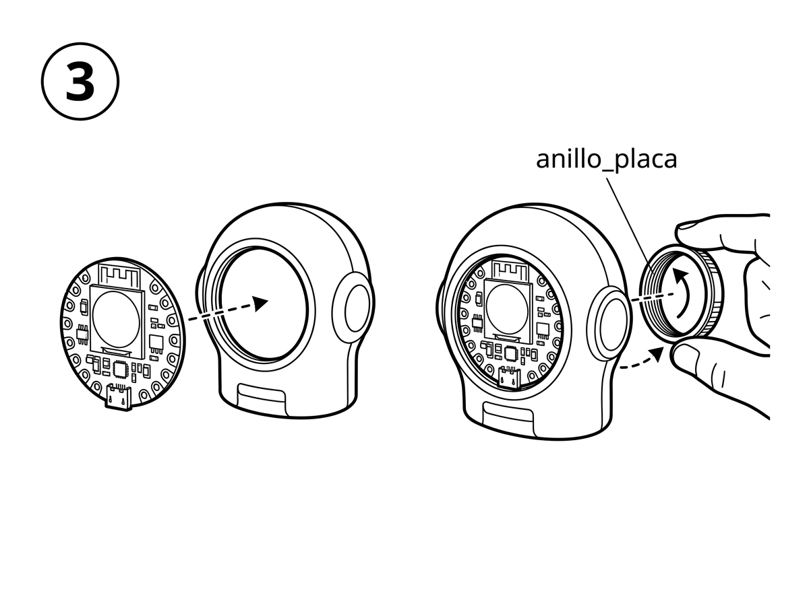

**3a — Insertar la placa:**
- Introduce la placa ESP32-S3 (con pantalla circular mirando hacia fuera) en el `cabeza_frente.stl`.

**3b — Roscar el anillo:**
- Introduce el `anillo_placa.stl` por detrás de la cabeza.
- Enrosca **con los dedos** en sentido horario hasta tope firme.
- **No uses herramientas.**

---

### PASO 4 · Cerrar el casco

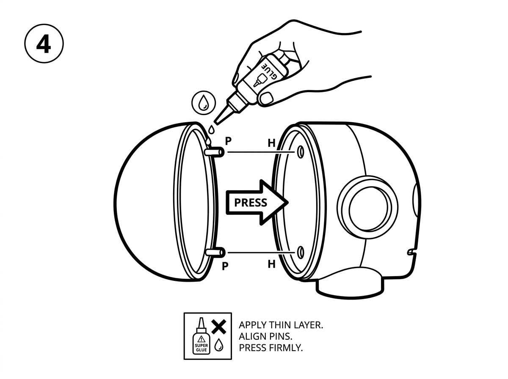

> ⚠️ **Una vez aplicado el pegamento, no hay marcha atrás.** Ensaya el encaje en seco primero.

- Aplica cianoacrilato en la pestaña de unión del `cabeza_dorso.stl`.
- Encaja las **2 espigas de centrado** en sus **2 orificios**.
- Presiona firmemente **30–60 segundos**.
- Deja reposar **5 minutos**.

| Vista frontal | Vista trasera | Vista lateral |
|:---:|:---:|:---:|
|  |  |  |

---

### PASO 5 · Aro visor y orejas

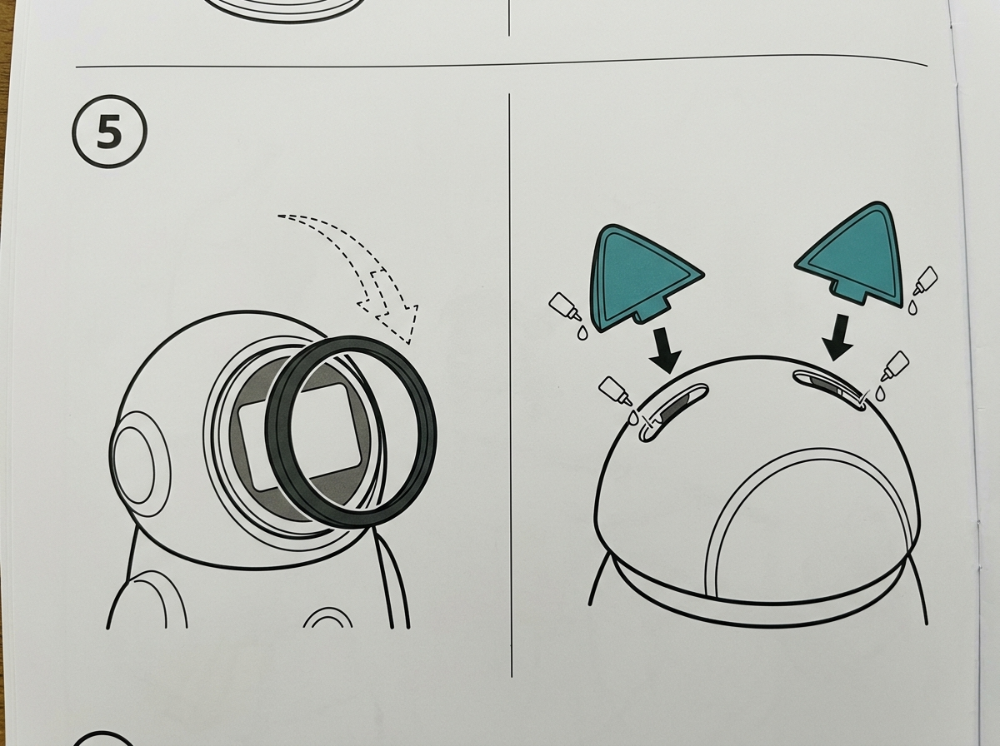

**5a — Aro visor (negro):**
- Cianoacrilato en reverso del `aro_visor.stl` → centrar sobre pantalla → presionar 15 s.

**5b — Orejas (turquesa):**
- Cianoacrilato en espiga → introducir en hueco superior izquierdo → 15 s.
- Repetir con oreja derecha.

**5c — Botón lateral:**
- Pegar `boton.stl` en la sien derecha.

---

### PASO 6 · Emblema del pecho

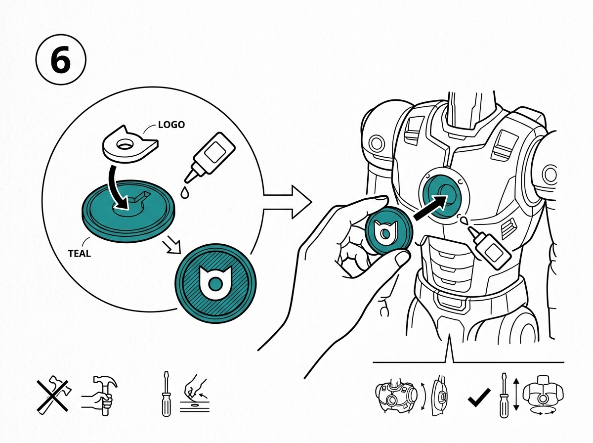

**6a:** Cianoacrilato en hueco del `emblema.stl` → presionar `logo.stl` dentro → esperar 2 min.

**6b:** Cianoacrilato en reverso del conjunto → pegar **centrado** en el pecho del cuerpo.

---

### PASO 7 · Batería y mochila

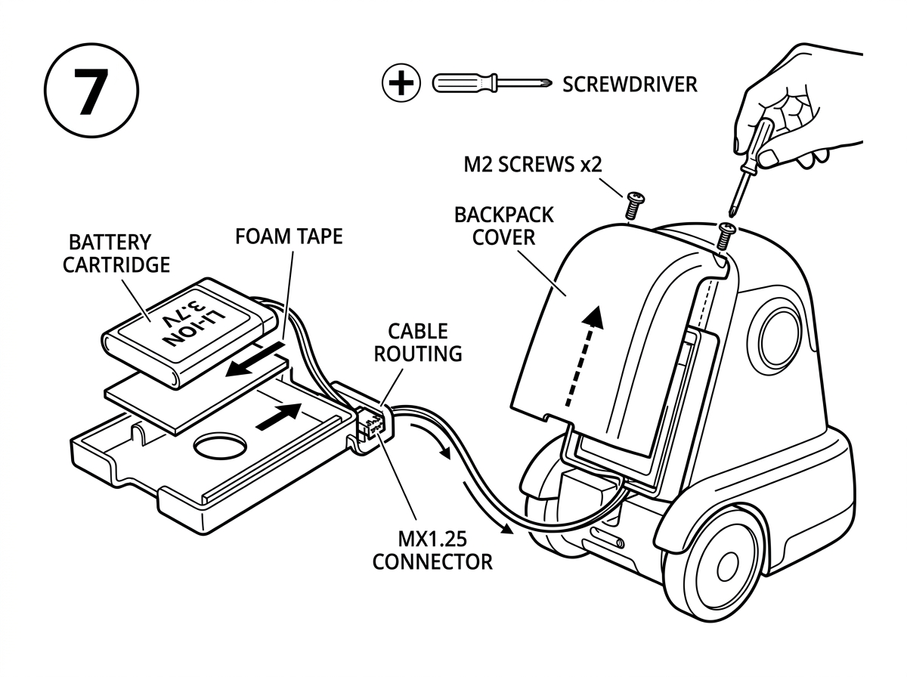

1. Cinta de espuma doble cara en base del `cartucho.stl` → pegar celda de litio.
2. Insertar cartucho+batería en compartimento interior del cuerpo → conectar MX1.25.
3. Colocar `mochila.stl` → 2 tornillos M2×8 mm → apretar suavemente.

---

### PASO 8 · Brazos y piernas

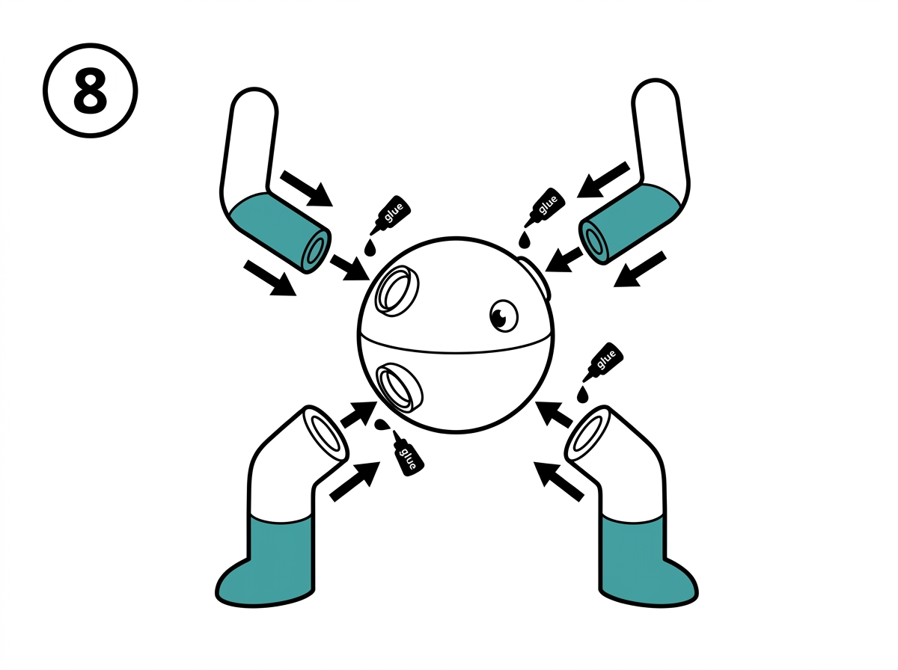

> Turquesa siempre **hacia abajo** (puños y botas). Blanco hacia arriba (hombros y piernas).

Cianoacrilato en cada espiga → introducir en cajera correspondiente → presionar 15 s cada una.
Dejar secar **10 minutos** boca arriba.

---

### PASO 9 · Pulsadores bajo barbilla *(opcional)*

> ⚠️ Solo si las cotas de tu placa coinciden. Si no entra sin forzar, omite este paso.

- Deslizar `pulsadores.stl` en la ranura bajo la barbilla. No requiere pegamento.

---

### PASO 10 · Colocar la cabeza sobre el cuerpo

- Muesca del collar al frente (zona USB-C libre).
- Bajar el casco sobre el cuello del cuerpo.
- **El casco no se pega** — queda apoyado y es desmontable.

---

## ✅ Resultado Final

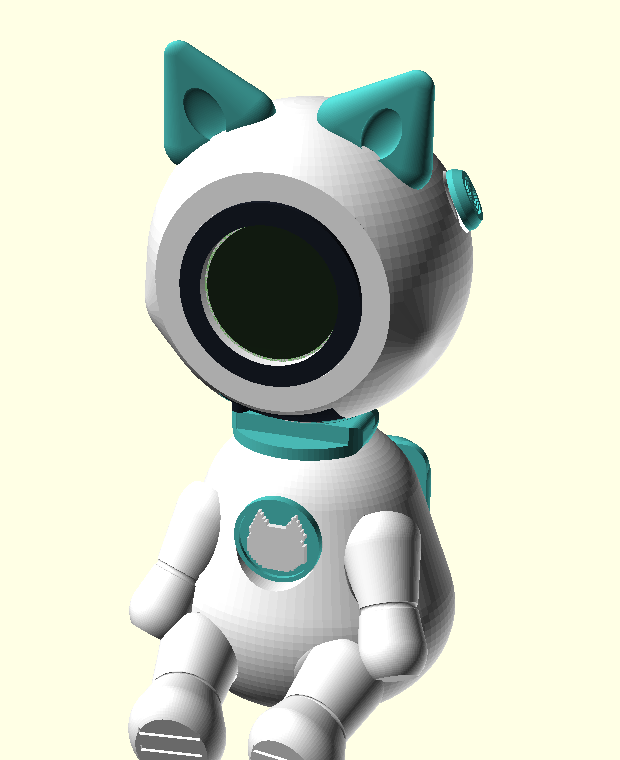

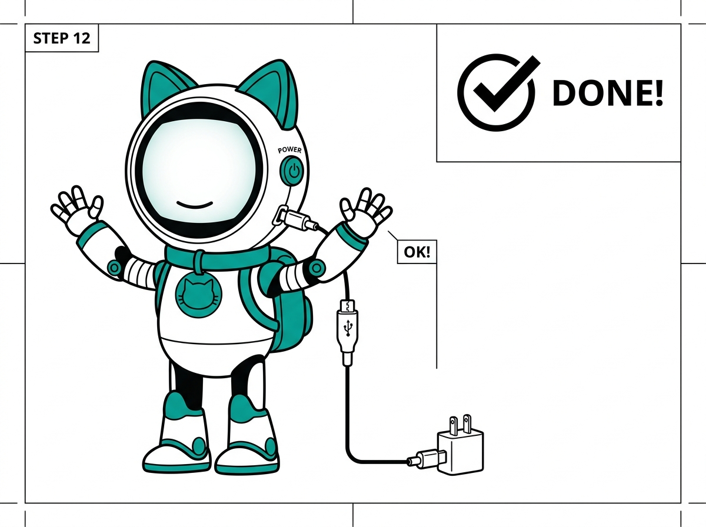

---

## 🔌 Puerto de carga USB-C

Cable USB-C por la **ranura de 16 mm bajo la barbilla** sin desmontar la figura.

---

## 🔘 Botones de control

Botones `REST` y `BOOT` accesibles a través de `pulsadores.stl` bajo la barbilla.

---

## ⚠️ Advertencias

- 🔥 El cianoacrilato es permanente. Ensaya en seco antes de pegar.
- 🔩 No sobreaprietes los tornillos M2. El PLA se puede agrietar.
- ⚡ Litio-Ion: no cortes ni perfores la batería. En caso de hinchazón, retira y desecha correctamente.

---

## 📐 Tolerancias de referencia

| Zona | Tolerancia diseñada |
|---|---|
| Rosca M55 (anillo placa) | ±0,2 mm — dedos únicamente |
| Espigas de orejas | Presión sin pegamento *(comprueba primero)* |
| Cajeras de brazos/piernas | Pegamento necesario |
| Insertos M2 | Soldador, sin presión mecánica |

---

*Manual generado · Proyecto Lúa V14 · Valeria+ / VIA+ · USC Fase 3 · Sept 2026*
