# 🤖 LÚA — Manual de Ensamble Técnico Real
### Mascota Robótica · Valeria+ / VIA+ · V14 (Fase 3 USC) · Septiembre 2026

---

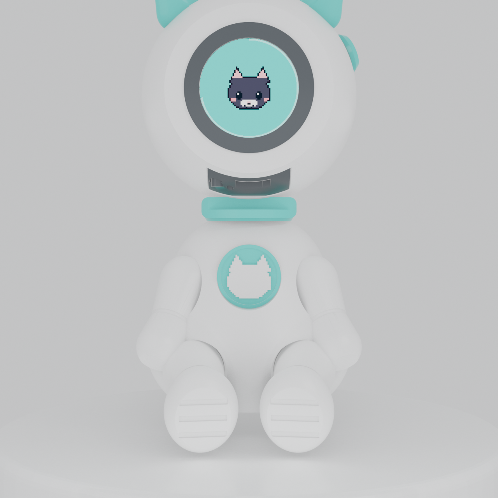

---

## 📋 Introducción y Principio de Montaje

Este manual describe el procedimiento exacto de montaje para las **piezas reales impresas en 3D** diseñadas en [`lua-firmware/cad/lua-muneco.scad`](../lua-firmware/cad/lua-muneco.scad) para la Ender-3 S1 Pro.

Todas las figuras y vistas que acompañan a esta guía son **renders 3D y capturas CAD reales del propio modelo**, eliminando cualquier ilustración genérica o inventada.

---

## 🗂️ 1. Inventario Oficial de Piezas Impresas (20 Piezas)

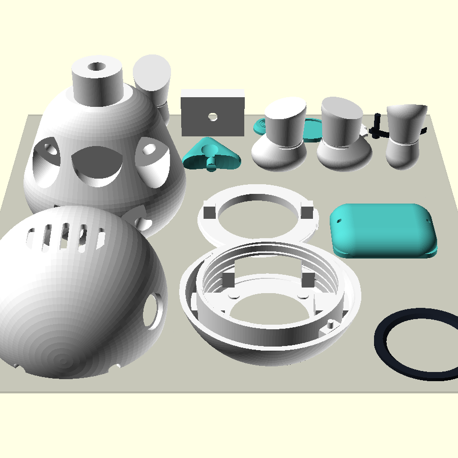

### Catálogo de Piezas del Muñeco:

| Letra | Pieza | Archivo STL | Color Impreso | Cant. | Función en el Ensamble |
|:---:|---|---|:---:|:---:|---|
| **A** | **Cuerpo** | `cuerpo.stl` | ⬜ Blanco | 1 | Tronco principal. Aloja la batería, 2 insertos dorsales y cajeras de miembros. |
| **B** | **Cabeza frontal** | `cabeza_frente.stl` | ⬜ Blanco | 1 | Cara frontal, visor circular, 4 costillas interiores y rosca trapecial M55. |
| **C** | **Cabeza dorso** | `cabeza_dorso.stl` | ⬜ Blanco | 1 | Cúpula con respiraderos, boca de cuello y 2 espigas de centrado forzoso. |
| **D** | **Brazo izquierdo** | `brazo_izq.stl` | 🟦/⬜ Bicolor | 1 | Brazo impreso vertical. Puño turquesa (hasta Z=16.5 mm) y hombro blanco. |
| **E** | **Brazo derecho** | `brazo_der.stl` | 🟦/⬜ Bicolor | 1 | Brazo impreso vertical. Puño turquesa (hasta Z=16.5 mm) y hombro blanco. |
| **F** | **Pierna izquierda** | `pierna_izq.stl` | 🟦/⬜ Bicolor | 1 | Pierna impresa vertical. Bota turquesa (hasta Z=14.0 mm) y muslo blanco. |
| **G** | **Pierna derecha** | `pierna_der.stl` | 🟦/⬜ Bicolor | 1 | Pierna impresa vertical. Bota turquesa (hasta Z=14.0 mm) y muslo blanco. |
| **H** | **Oreja izquierda** | `oreja_izq.stl` | 🟦 Turquesa | 1 | Oreja con espiga de anclaje para la parte superior del casco. |
| **I** | **Oreja derecha** | `oreja_der.stl` | 🟦 Turquesa | 1 | Oreja con espiga de anclaje para la parte superior del casco. |
| **J** | **Collar** | `collar.stl` | 🟦 Turquesa | 1 | Anillo del cuello con muesca pasante para el túnel de carga USB-C. |
| **K** | **Mochila** | `mochila.stl` | 🟦 Turquesa | 1 | Tapa trasera asegurada con 2 tornillos métrica M2 × 8 mm. |
| **L** | **Botón de sien** | `boton.stl` | 🟦 Turquesa | 1 | Dial estético con 3 surcos concéntricos en la sien derecha. |
| **M** | **Emblema** | `emblema.stl` | 🟦 Turquesa | 1 | Aro de Ø22 mm centrado en el pecho. Aloja la pastilla del logo. |
| **N** | **Logo** | `logo.stl` | ⬜ Blanco | 1 | Silueta recortada de la gata Lúa en relieve blanco dentro del emblema. |
| **O** | **Aro visor** | `aro_visor.stl` | ⬛ Negro | 1 | Marco circular que enmarca la pantalla LCD IPS redonda. |
| **P** | **Anillo de placa** | `anillo_placa.stl` | ⬜ Blanco | 1 | Rosca trapecial Ø55 M55. Retiene la PCB firmemente sin aplastarla. |
| **Q** | **Cartucho batería** | `cartucho.stl` | ⬜ Blanco | 1 | Cuna interior deslizante para alojar la celda con cinta doble cara. |
| **R** | **Pulsadores** | `pulsadores.stl` | ⬛ Negro | 1 | Embellecedor bajo barbilla para puerto USB-C y botón BOOT. |
| **S** | **Insertos roscados M2** | — | 🟡 Latón | 2 | Insertos M2 (longitud 3-4 mm) fijados por calor en la espalda. |
| **T** | **Tornillos M2 × 8 mm** | — | 🩶 Acero | 2 | Tornillos métricos para fijar la mochila a los insertos de latón. |

---

### Probetas de Calibración Previa (No van en el muñeco montado):

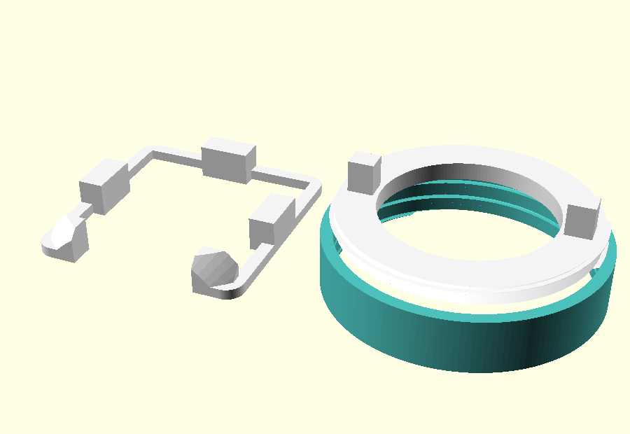

- **`testigo_placa.stl`**: Marco para comprobar que tu PCB entra entre las 4 costillas y que la pestaña de conectores cae en la ranura.
- **`testigo_rosca.stl`**: Barril de 12 mm para probar que el `anillo_placa.stl` enrosca suave antes de lanzar la cabeza.

---

## 🔧 2. Herramientas y Materiales Necesarios

| Herramienta / Material | Función en el Ensamble |
|---|---|
| 🔧 **Soldador de punta fina** | Ajustado a ~200 °C para insertar los 2 casquillos roscados M2 en la espalda. |
| 🧴 **Cianoacrilato de viscosidad media** | Para la unión del casco, orejas, botón de sien, emblema y extremidades. |
| 🔩 **Destornillador Phillips M2** | Para apretar los 2 tornillos M2 × 8 mm de la mochila trasera. |
| 📏 **Cinta de espuma de doble cara** | Para amortiguar y fijar la celda de litio dentro del cartucho. |

---

## 🔨 3. Procedimiento de Ensamble Paso a Paso (Secuencia Real)

---

### PASO 1 · Instalación de los Insertos Térmicos M2 en la Espalda

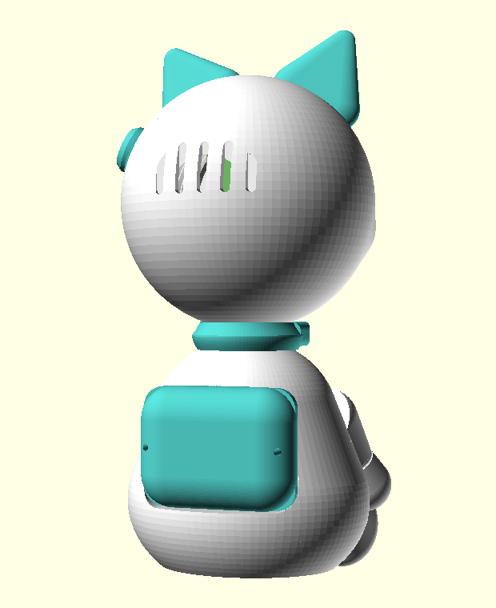

1. Enchufa el soldador de punta fina a **~200 °C**.
2. Apoya el `cuerpo.stl` boca abajo sobre una mesa firme y plana.
3. Coloca un inserto roscado de latón M2 sobre cada uno de los dos orificios de la espalda (cajeras de la mochila).
4. Apoya suavemente la punta del soldador sobre el inserto. Deja que el calor residual reblandezca el PLA: **el inserto debe descender por calor, nunca forzado a golpes**.
5. Deja que quede enrasado con la superficie. Retira el soldador y deja enfriar **2 minutos** sin moverlo.

---

### PASO 2 · Deslizar el Collar al Cuello (¡ANTES de Pegar la Cabeza!)

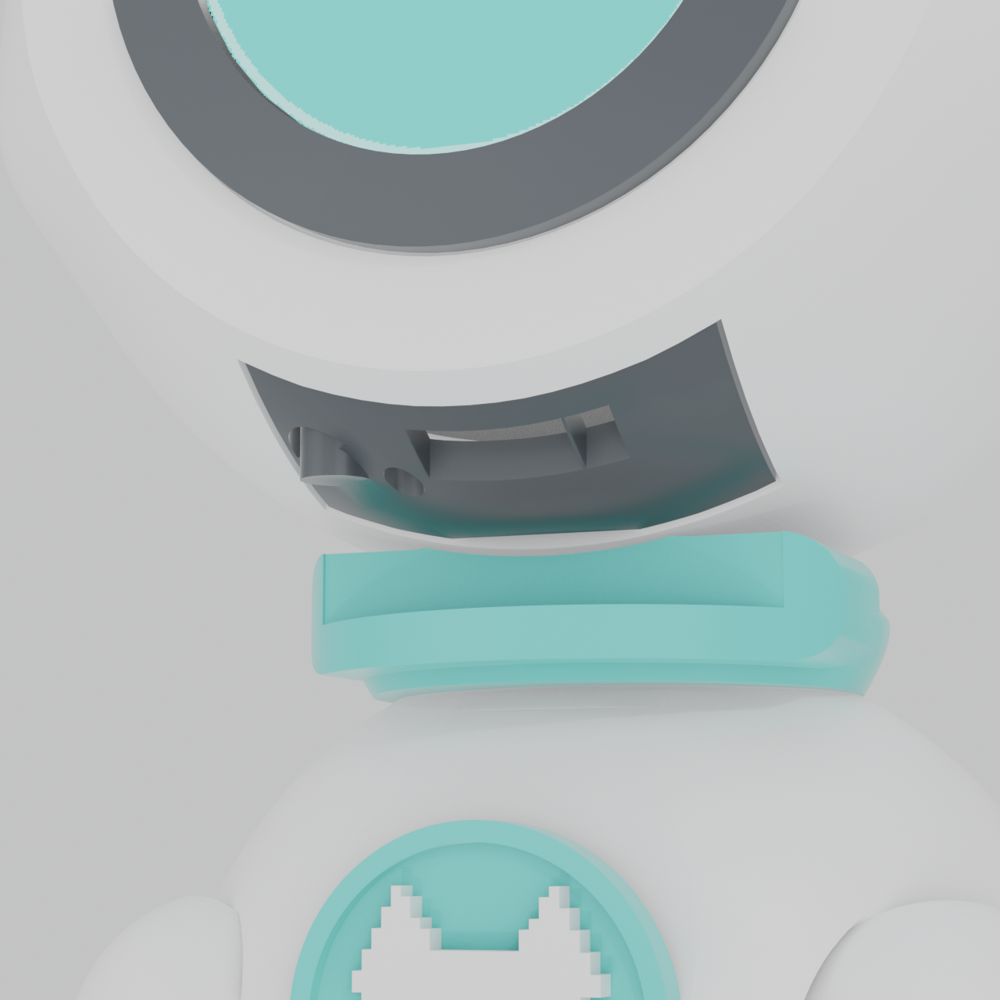

> ⛔ **REGLA CRÍTICA DE MONTAJE:**  
> El `collar.stl` (anillo turquesa) **DEBE** deslizarse por la espiga del cuello antes de montar la cabeza. Si colocas o pegas la cabeza sin el collar, no podrás introducirlo después.

1. Toma el `collar.stl`.
2. Observa la **muesca pasante** que tiene en su borde frontal.
3. Deslízalo por el cuello cilíndrico del `cuerpo.stl` asegurando que la muesca apunte **hacia el frente**, justo donde desemboca el túnel de carga USB-C.
4. **NO uses pegamento**: el collar debe quedar libre para girar suavemente.

---

### PASO 3 · Montaje de la Electrónica en `cabeza_frente.stl`

1. **Presentación de la PCB:**  
   Introduce la placa ESP32-S3 por la parte trasera de `cabeza_frente.stl`. La pantalla redonda IPS debe apoyar en los 4 topes frontales del visor y quedar centrada entre las 4 costillas perimetrales.
2. **Orientación de Conectores:**  
   Verifica que el canto de los conectores (USB-C y pulsadores) quede orientado hacia abajo, en la ranura bajo la barbilla.
3. **Fijación con `anillo_placa.stl`:**  
   Introduce el `anillo_placa.stl` por detrás de la placa en el barril roscado M55.
4. Enrosca en sentido horario **únicamente con dos dedos por las alas de apriete, a mano y sin herramientas**.  
   *Nota: La rosca absorbe holguras entre 8 y 16 mm. Un apriete a mano sujeta firmemente la placa sin doblarla.*

---

### PASO 4 · Cierre y Sellado del Casco

| Vista Lateral CAD | Vista Frontal CAD | Vista Trasera CAD |
|:---:|:---:|:---:|
| 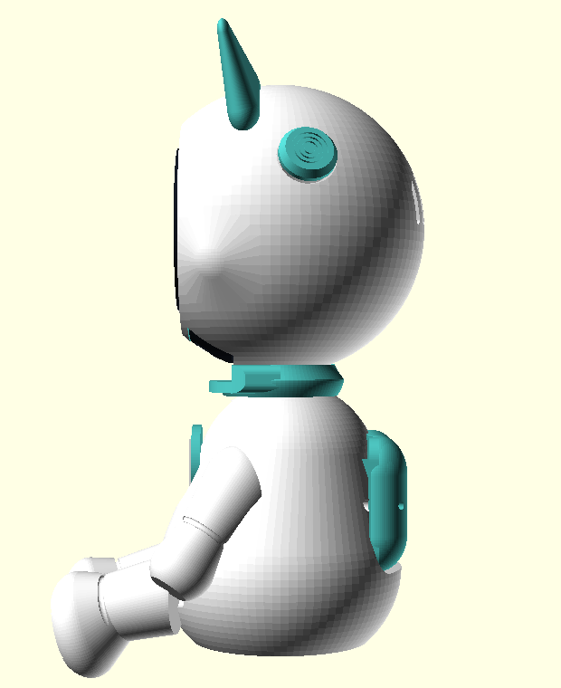 | 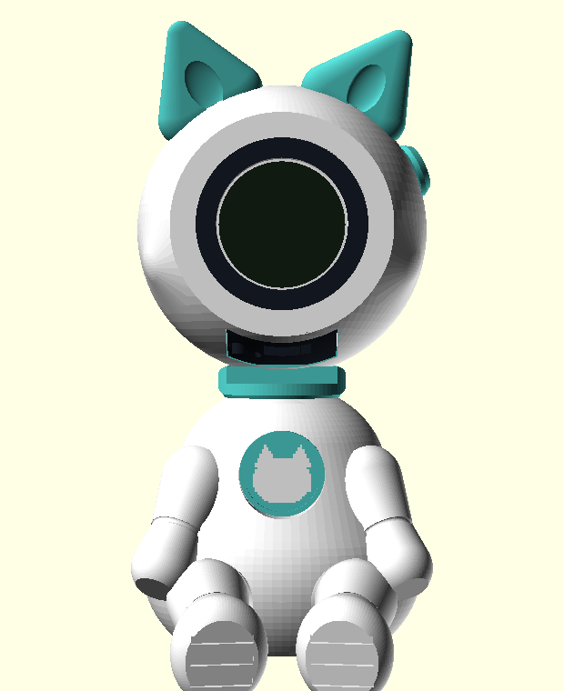 |  |

> ⚠️ **ENSAYO EN SECO:**  
> Las dos mitades de la cabeza llevan **2 espigas de centrado** en la junta de unión. Encájalas en seco primero para comprobar que entran suavemente. Si rozan, pasa una lija fina por las espigas.

1. Aplica una fina hilera de cianoacrilato en la pestaña de unión perimetral de `cabeza_dorso.stl`.
2. Encaja `cabeza_dorso.stl` contra `cabeza_frente.stl` haciendo coincidir las 2 espigas en sus orificios.
3. Presiona firmemente ambas mitades durante **45 a 60 segundos**.
4. Deja curar **5 minutos**.  
   *(Esta junta no se vuelve a abrir: los cables no deben sufrir fatiga).*

---

### PASO 5 · Instalación de Accesorios de Cabeza

1. **Aro del Visor (`aro_visor.stl`):**  
   Aplica una gota mínima de cianoacrilato en el reverso del marco negro y pégalo alrededor del cristal de la pantalla en la cara frontal.
2. **Orejas (`oreja_izq.stl` y `oreja_der.stl`):**  
   Aplica adhesivo en las espigas de las orejas turquesas e insértalas en los huecos superiores del casco. Presiona 15 s.
3. **Botón de Sien (`boton.stl`):**  
   Pega el disco turquesa con los 3 surcos concéntricos en el rebaje de la sien derecha. *(Es un dial estético de traje espacial).*

---

### PASO 6 · Emblema y Logo en el Pecho

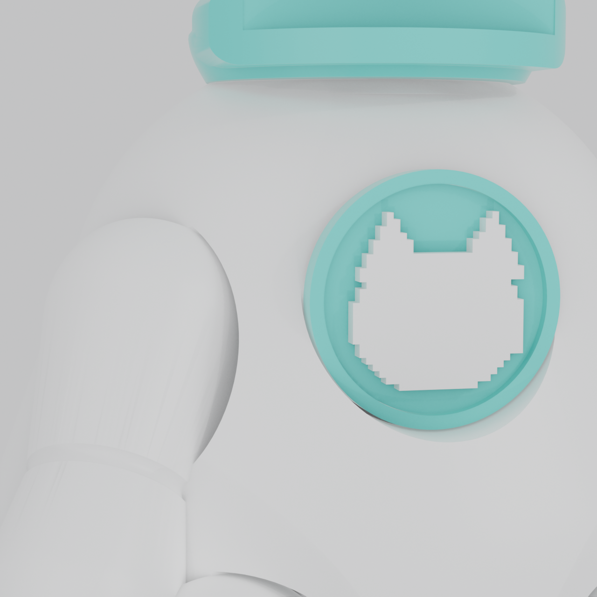

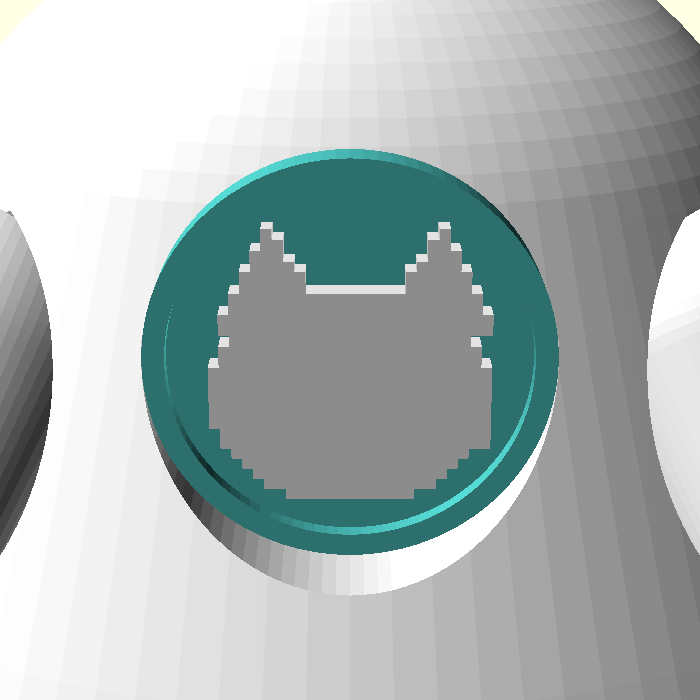

1. **Subensamble del Logo:**  
   Aplica una microgota de cianoacrilato en el hueco interior de `emblema.stl` (aro turquesa de Ø22 mm).
2. Encaja la pastilla `logo.stl` (silueta blanca en relieve de Lúa) dentro del aro. Espera 2 minutos.
3. **Fijación al Torso:**  
   Aplica cianoacrilato en la cara trasera del emblema y pégalo **perfectamente centrado en el pecho** del `cuerpo.stl`. El modelo V14 tiene el asiento adelantado +1,9 mm para que asiente al ras.

---

### PASO 7 · Batería de Litio y Fijación de la Mochila

1. Coloca una tira de cinta de espuma doble cara en la cuna de `cartucho.stl` y pega la celda de litio firmemente.
2. Desliza el cartucho con la batería en la bahía interna del cuerpo.
3. Conecta el cable con conector MX1.25 a la placa dentro de la cabeza.
4. Coloca la `mochila.stl` sobre la espalda y atornilla los **2 tornillos M2 × 8 mm** en los insertos de latón instalados en el Paso 1.
   *(El doble tornillo garantiza que la tapa no pivote y protege la celda de manipulación infantil).*

---

### PASO 8 · Extremidades Bicolor (Brazos y Piernas)

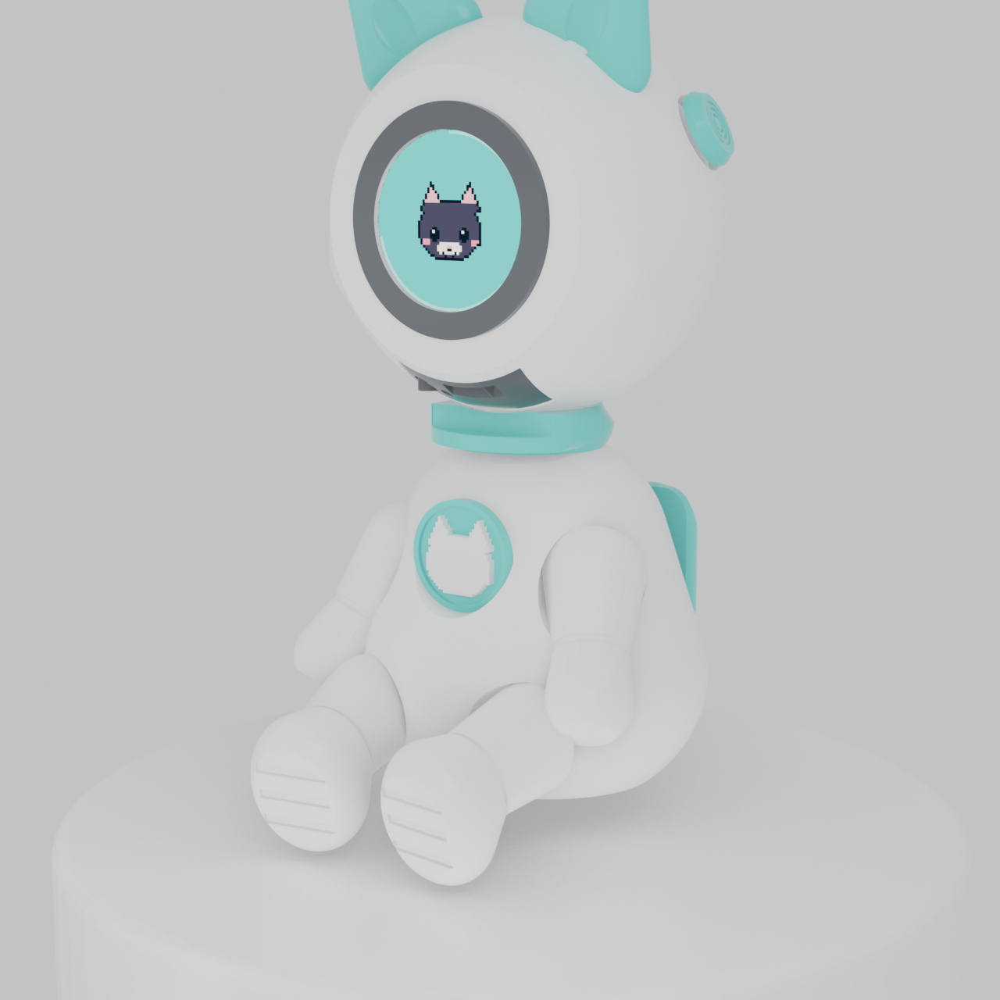

1. Comprueba la orientación de las piezas:
   - **Puños y Botas (Turquesa):** Miran siempre hacia abajo.
   - **Hombros y Muslos (Blanco):** Encajan en las cajeras del tronco.
2. Aplica cianoacrilato en la espiga y cara plana de `brazo_izq.stl` e insértalo en la cajera del hombro izquierdo. Presiona 20 s.
3. Repite el proceso con `brazo_der.stl`, `pierna_izq.stl` y `pierna_der.stl`.
4. Deja reposar el muñeco acostado boca arriba durante **10 minutos** para curado químico completo.

---

### PASO 9 · Túnel de Carga USB-C y Pulsadores

| Túnel de Carga USB-C bajo Barbilla | Pulsadores REST / BOOT |
|:---:|:---:|
| 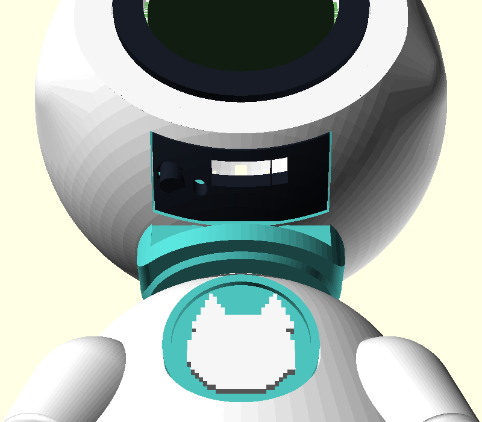 | 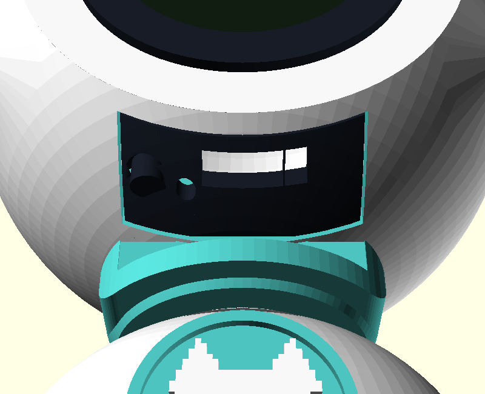 |

1. **Acceso USB-C:**  
   La ranura pasante bajo la barbilla permite conectar directamente un cable estándar USB-C sin tener que desmontar el muñeco.
2. **Pulsadores:**  
   Si tu placa física coincide con las cotas del proveedor, la pieza `pulsadores.stl` se inserta bajo la barbilla para guiar el conector USB-C y proteger los botones `REST` (agujero de aguja) y `BOOT` (tecla activa de interacción).

---

### PASO 10 · Colocación de la Cabeza sobre el Cuerpo

- El casco **NO se pega al cuerpo**.
- La boca cilíndrica del cuello encaja por gravedad y fricción sobre la espiga superior del tronco.
- Esto permite:
  - Girar la cabeza para orientar la mirada.
  - Desmontar la cabeza tirando hacia arriba en cualquier momento para inspeccionar la electrónica sin romper la figura.

---

## 📐 4. Tolerancias y Directrices de Seguridad

| Zona Mecánica | Tolerancia CAD | Recomendación de Taller |
|---|:---:|---|
| **Rosca M55 (anillo_placa)** | ±0,30 mm | Roscar a mano. Si ofrece resistencia, repasar la costura con un cepillo. |
| **Espigas de centrado casco** | Ø2,4 mm | No forzar. Si la junta no cierra a ras, rebajar ligeramente la espiga con lija. |
| **Cajeras de extremidades** | +0,15 mm | Diseñadas para adherencia con cianoacrilato. No dejar sin pegar. |
| **Insertos de latón M2** | Ø3,2 mm | No introducir mecánicamente en frío; utilizar siempre el calor del soldador. |

---

*Manual técnico oficial · Proyecto Lúa V14 · Valeria+ / VIA+ · Tesis Doctoral USC 2023–2027*
