# 🤖 LÚA — Manual de Ensamble Técnico Real
### Mascota Robótica · Valeria+ / VIA+ · V15 (Fase 3 USC) · Septiembre 2026

---

## 🆕 Novedades de la revisión x1 (23/9/2026)

Esta revisión elimina el pegamento estructural, los tornillos M2 y los insertos
de latón. Todo encaja a presión o con un cuarto de vuelta, como piezas de Lego:

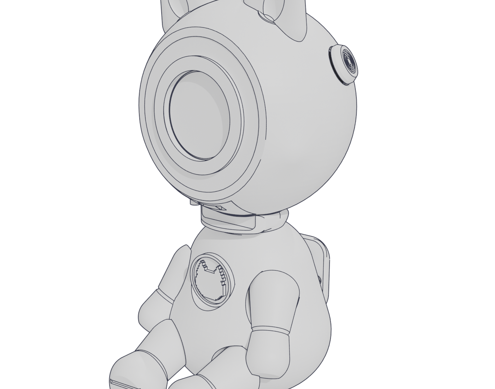

| Unión | Antes (V14) | Ahora (V15) | Detalle |
|:---|---|---|---|
| Casco (2 mitades) | 2 espigas + cianoacrilato | Aro a presión con 3 llaves asimétricas («de Lego») | Cierre recto en una sola posición; abre tirando |
| Orejas | Espiga Ø5 pegada | Espiga en D Ø8 anti-rotación (sin pegamento) | Impresa tumbada para máxima resistencia Z |
| Mochila | 2 tornillos M2 + insertos | 2 pernos sueltos press-fit Ø4 × 6,6 | Tapa a presión; sin tornillos |
| Extremidades (brazos/patas) | Pegados (0,5 mm de juego) | Espigas Ø8/Ø9 con nervios tipo Lego | Brazo recortado abrazando la barriga |
| Cabeza / Electrónica | Hueco placa rectangular | Carcasa redonda Ø50×13 mm, labio + anillo cónico M55 | Cabeza Φ78 exacta a la foto |

---

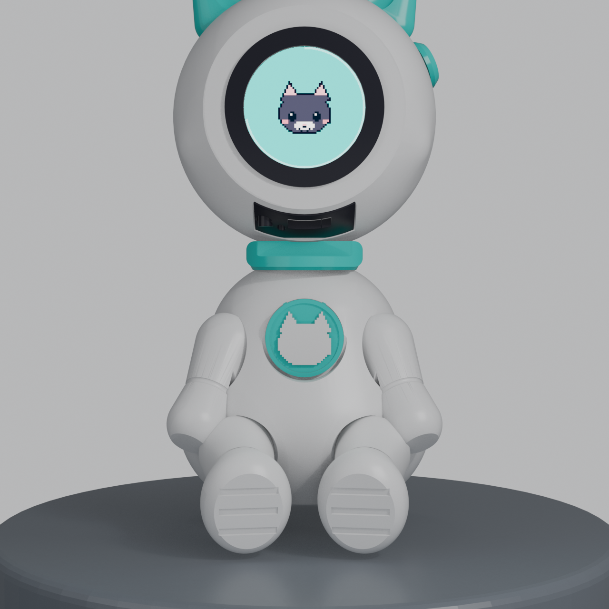

---

## 📋 Introducción y Principio de Montaje

Este manual describe el procedimiento exacto de montaje para las **piezas reales impresas en 3D** diseñadas en [`lua-firmware/cad/lua-muneco.scad`](../lua-firmware/cad/lua-muneco.scad) para la Ender-3 S1 Pro.

Todas las figuras y vistas que acompañan a esta guía son **renders 3D y capturas CAD reales del propio modelo**, eliminando cualquier ilustración genérica o inventada.

---

## 🗂️ 1. Inventario Oficial de Piezas Impresas (21 Piezas)

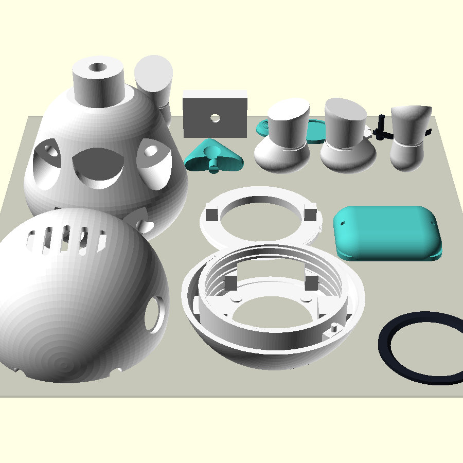

### Catálogo de Piezas del Muñeco:

| Letra | Pieza | Archivo STL | Color Impreso | Cant. | Función en el Ensamble |
|:---:|---|---|:---:|:---:|---|
| **A** | **Cuerpo** | `cuerpo.stl` | ⬜ Blanco | 1 | Tronco principal. Aloja la batería, 2 taladros para pernos y cajeras press-fit de miembros. |
| **B** | **Cabeza frontal** | `cabeza_frente.stl` | ⬜ Blanco | 1 | Cara frontal, visor circular, labio de centrado para carcasa Ø50 mm, rosca M55x2 y espolón con 3 llaves rectas asimétricas. |
| **C** | **Cabeza dorso** | `cabeza_dorso.stl` | ⬜ Blanco | 1 | Cúpula con respiraderos, boca de cuello press-fit, manga con 3 canales para llaves y cajeras con banda reforzada para espigas en D de orejas. |
| **D** | **Brazo izquierdo** | `brazo_izq.stl` | 🟦/⬜ Bicolor | 1 | Brazo con espiga macho Ø8 mm Lego y recorte curvo que abraza el cuerpo sin colisionar. |
| **E** | **Brazo derecho** | `brazo_der.stl` | 🟦/⬜ Bicolor | 1 | Brazo con espiga macho Ø8 mm Lego y recorte curvo que abraza el cuerpo sin colisionar. |
| **F** | **Pierna izquierda** | `pierna_izq.stl` | 🟦/⬜ Bicolor | 1 | Pierna con espiga macho Ø9 mm Lego y nervios de aplastamiento. |
| **G** | **Pierna derecha** | `pierna_der.stl` | 🟦/⬜ Bicolor | 1 | Pierna con espiga macho Ø9 mm Lego y nervios de aplastamiento. |
| **H** | **Oreja izquierda** | `oreja_izq.stl` | 🟦 Turquesa | 1 | Oreja con espiga en D Ø8 anti-rotación (impresa tumbada). Sin pegamento. |
| **I** | **Oreja derecha** | `oreja_der.stl` | 🟦 Turquesa | 1 | Oreja con espiga en D Ø8 anti-rotación (impresa tumbada). Sin pegamento. |
| **J** | **Collar** | `collar.stl` | 🟦 Turquesa | 1 | Anillo del cuello con muesca pasante para el túnel de carga USB-C. |
| **K** | **Mochila** | `mochila.stl` | 🟦 Turquesa | 1 | Tapa trasera con 2 cajeras ciegas para los pernos sueltos. Sin tornillos. |
| **L** | **Botón de sien** | `boton.stl` | 🟦 Turquesa | 1 | Dial estético con 3 surcos concéntricos en la sien derecha. |
| **M** | **Emblema** | `emblema.stl` | 🟦 Turquesa | 1 | Aro de Ø22 mm centrado en el pecho. Entra a presión; aloja la pastilla del logo. |
| **N** | **Logo** | `logo.stl` | ⬜ Blanco | 1 | Silueta recortada de la gata Lúa en relieve blanco dentro del emblema. |
| **O** | **Aro visor** | `aro_visor.stl` | ⬛ Negro | 1 | Marco circular que enmarca la pantalla LCD IPS redonda. |
| **P** | **Anillo de placa** | `anillo_placa.stl` | ⬜ Blanco | 1 | Rosca trapecial Ø55 M55. Retiene la PCB firmemente sin aplastarla. |
| **Q** | **Cartucho batería** | `cartucho.stl` | ⬜ Blanco | 1 | Cuna interior deslizante para alojar la celda con cinta doble cara. |
| **R** | **Pulsadores** | `pulsadores.stl` | ⬛ Negro | 1 | Embellecedor bajo barbilla para puerto USB-C y botón BOOT. |
| **S** | **Pernos de mochila** | `pernos_mochila.stl` | ⬜ Blanco | 2 | Pernos sueltos Ø4 × 6,6 con pico guía: uno vive en el cuerpo, la tapa entra y sale. |
| ~~**T** | **Tornillos M2 × 8 mm** | — | 🩶 Acero | 2 | ~~Eliminados en x1: la mochila ya no lleva tornillos ni insertos de latón.~~ |

---

### Probetas de Calibración Previa (No van en el muñeco montado):

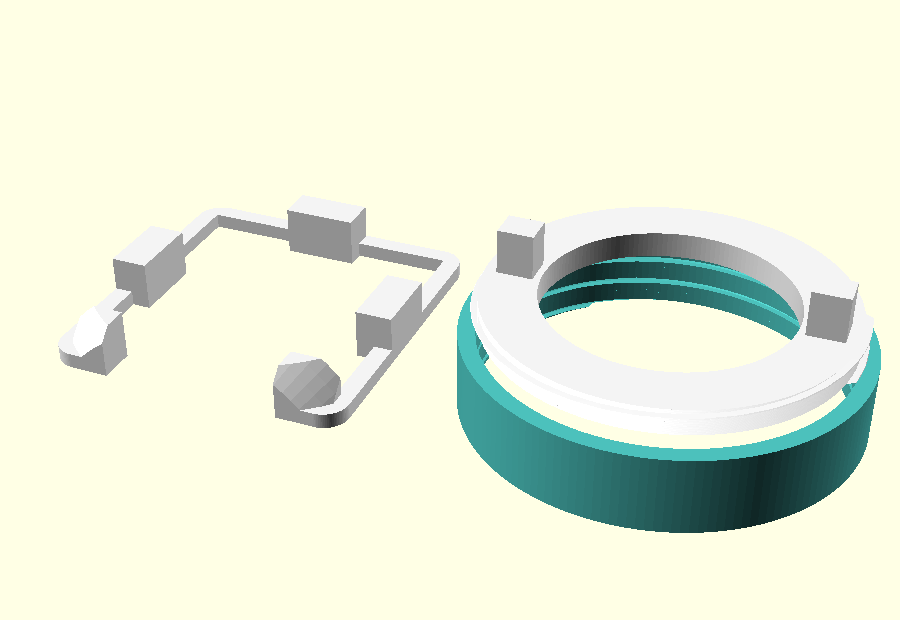

- **`testigo_placa.stl`**: Marco para comprobar que tu PCB entra entre las 4 costillas y que la pestaña de conectores cae en la ranura.
- **`testigo_rosca.stl`**: Barril de 12 mm para probar que el `anillo_placa.stl` enrosca suave antes de lanzar la cabeza.

---

## 🔧 2. Herramientas y Materiales Necesarios

| Herramienta / Material | Función en el Ensamble |
|---|---|
| 🧴 **Cianoacrilato de viscosidad media** | SOLO para piezas pequeñas vistas: aro del visor, botón de sien y pastilla del logo. Nada estructural lleva pegamento desde x1. |
| 📏 **Cinta de espuma de doble cara** | Para amortiguar y fijar la celda de litio dentro del cartucho. |
| 🗞️ **Lija fina (grano 220)** | Solo si un press-fit entra demasiado apretado: una pasada suave al vástago, nunca al agujero. |

---

## 🔨 3. Procedimiento de Ensamble Paso a Paso (Secuencia Real)

---

### PASO 1 · Clavar los 2 pernos de la mochila en la espalda

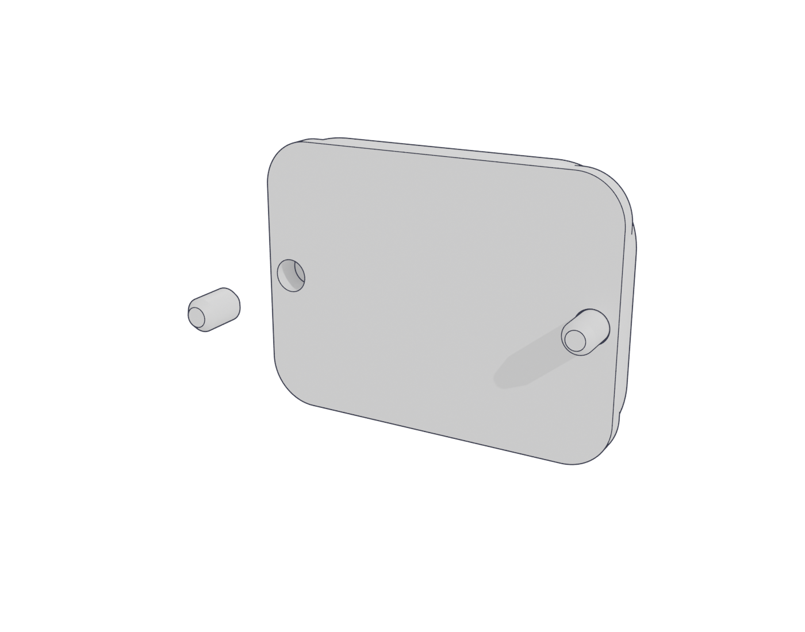

1. Apoya el `cuerpo.stl` boca abajo sobre una mesa firme y plana.
2. Toma los 2 `pernos_mochila.stl` e introdúcelos a presión en los dos taladros de la espalda (a ±20,5 mm del eje), con el pico guía por delante. Entran 3,0 mm y quedan 3,6 mm fuera.
3. Comprueba que no bailan: si un perno gira loco, una vuelta de cinta de carrocero en su mitad basta.
4. *(Si al abrir la tapa un perno sale con ella, se vuelve a clavar en el cuerpo: no es un fallo, es el diseño).*

---

### PASO 2 · Deslizar el Collar al Cuello (¡ANTES de montar la Cabeza!)

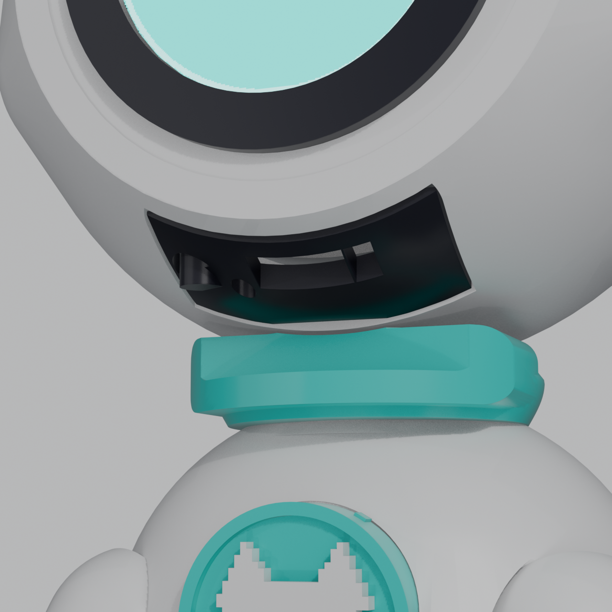

> ⛔ **REGLA CRÍTICA DE MONTAJE:**  
> El `collar.stl` (anillo turquesa) **DEBE** deslizarse por la espiga del cuello antes de montar la cabeza. Si colocas la cabeza sin el collar, no podrás introducirlo después.

1. Toma el `collar.stl`.
2. Observa la **muesca pasante** que tiene en su borde frontal.
3. Deslízalo por el cuello cilíndrico del `cuerpo.stl` asegurando que la muesca apunte **hacia el frente**, justo donde desemboca el túnel de carga USB-C.
4. **NO uses pegamento**: el collar debe quedar libre para girar suavemente.

---

### PASO 3 · Montaje de la Electrónica en `cabeza_frente.stl`

1. **Presentación de la PCB:**  
   Introduce la placa ESP32-S3 por la parte trasera de `cabeza_frente.stl`. La pantalla redonda IPS debe apoyar en los 4 topes frontales del visor y quedar centrada entre las 4 costillas perimetrales.
2. **Orientación de Conectores:**  
   Verifica que el canto de los conectores (USB-C y pulsadores) quede orientado hacia abajo, en la ranura bajo la barbilla.
3. **Fijación con `anillo_placa.stl`:**  
   Introduce el `anillo_placa.stl` por detrás de la placa en el barril roscado M55.
4. Enrosca en sentido horario **únicamente con dos dedos por las alas de apriete, a mano y sin herramientas**.  
   *Nota: La rosca absorbe holguras entre 8 y 16 mm. Un apriete a mano sujeta firmemente la placa sin doblarla.*

---

### PASO 4 · Cierre del Casco (aro a presión con 3 llaves LEGO, sin pegamento)

| Vista Lateral CAD | Vista Frontal CAD | Vista Trasera CAD |
|:---:|:---:|:---:|
| 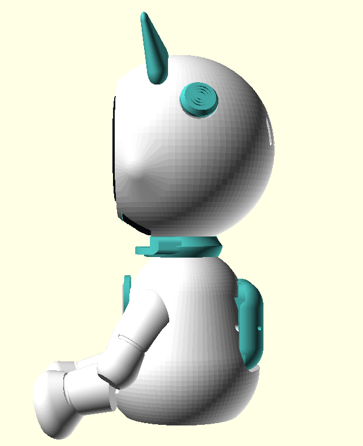 | 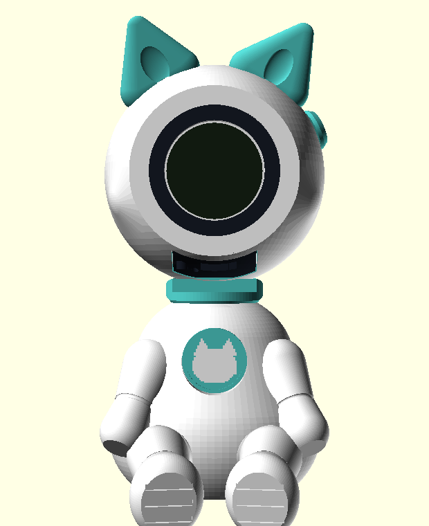 | 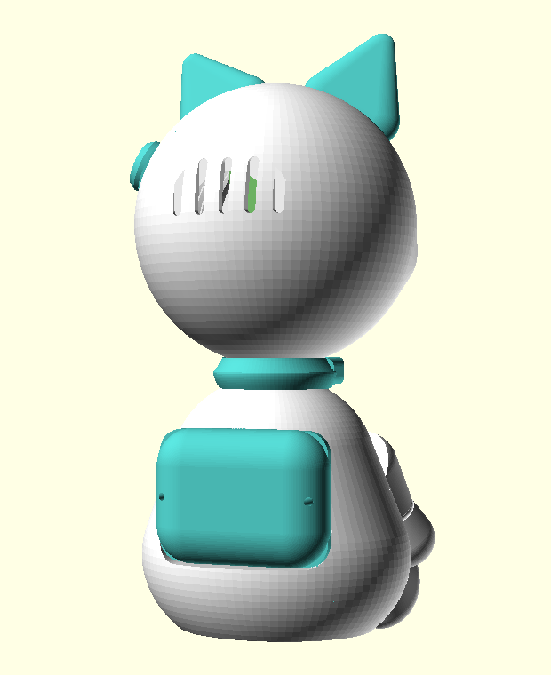 |

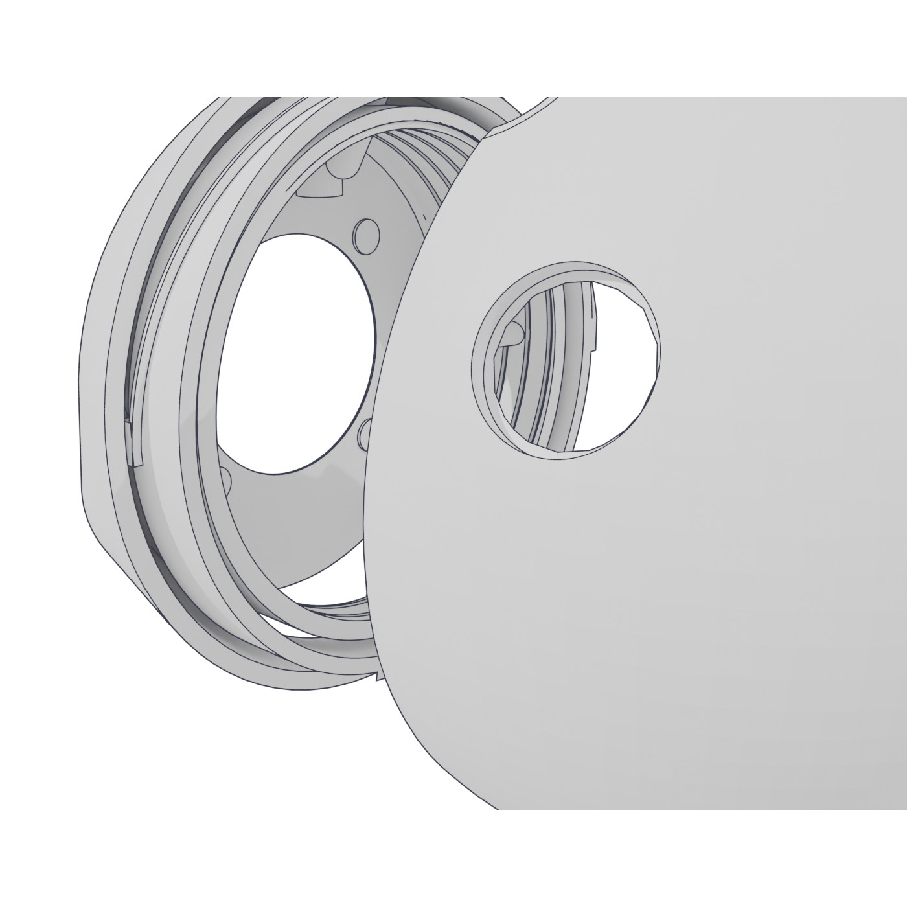

> ⚠️ **ENSAYO EN SECO:**  
> Presenta el dorso sobre el espolón de la frente. Las 3 llaves asimétricas solo dejan cerrar en UNA orientación: la que deja las orejas a plomo.

1. Presenta `cabeza_dorso.stl` sobre el espolón de `cabeza_frente.stl`, con las 3 llaves rectas encaradas a sus 3 canales.
2. Empuja recto a presión hasta que las dos caras se juntan a ras.
3. No lleva pegamento: la junta se abre tirando recto hacia fuera para inspeccionar la electrónica o cables.
4. *(Esta junta no se vuelve a abrir sola: los nervios de aplastamiento la retienen con firmeza).*

---

### PASO 5 · Instalación de Accesorios de Cabeza

1. **Aro del Visor (`aro_visor.stl`):**  
   Aplica una gota mínima de cianoacrilato en el reverso del marco negro y pégalo alrededor del cristal de la pantalla en la cara frontal. *(Es una de las 3 únicas piezas que aún llevan pegamento).*
2. **Orejas (`oreja_izq.stl` y `oreja_der.stl`):**

   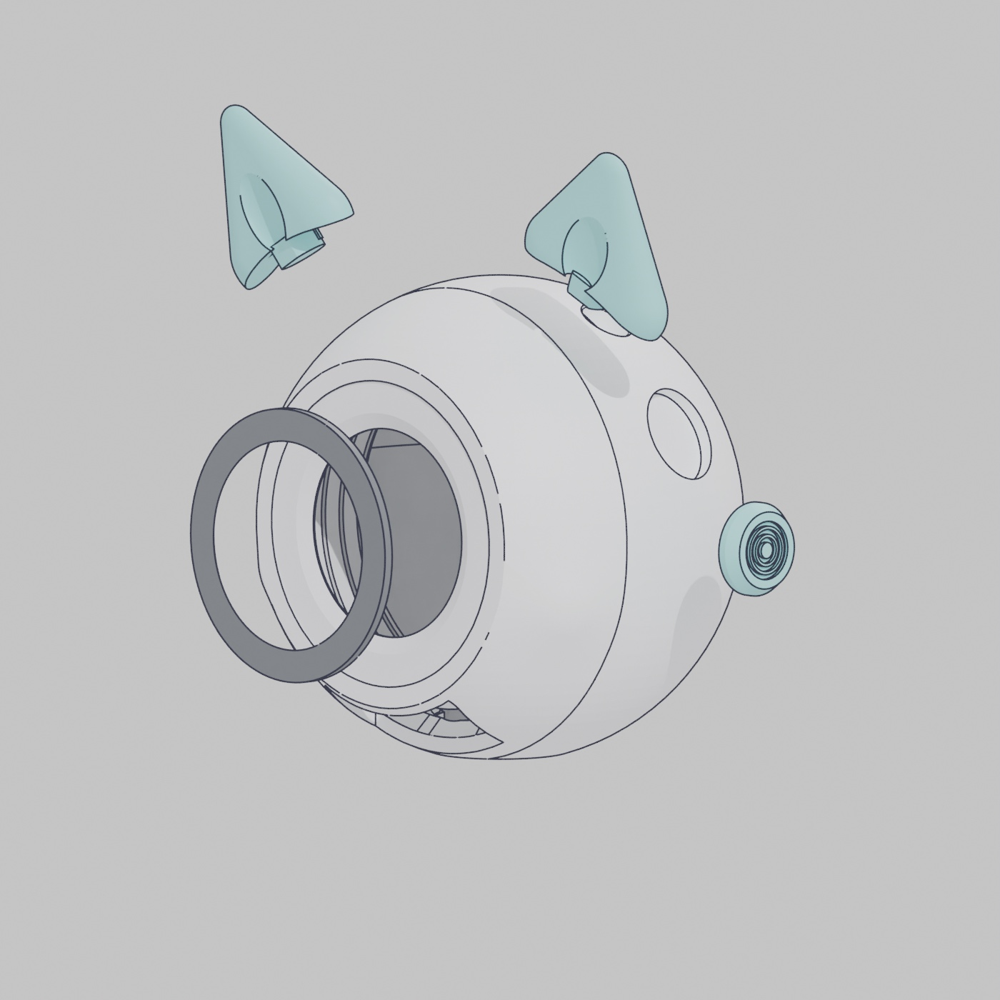

   Presenta cada oreja encarando su **espiga en D Ø8** a la cajera reforzada de la cabeza dorso y empuja a presión hasta que asienta. Sin pegamento ni giros: el perfil en D y los nervios fijan la orientación e impiden cualquier rotación.
3. **Botón de Sien (`boton.stl`):**  
   Pega el disco turquesa con los 3 surcos concéntricos en el rebaje de la sien derecha. *(Es un dial estético de traje espacial).*

---

### PASO 6 · Emblema y Logo en el Pecho

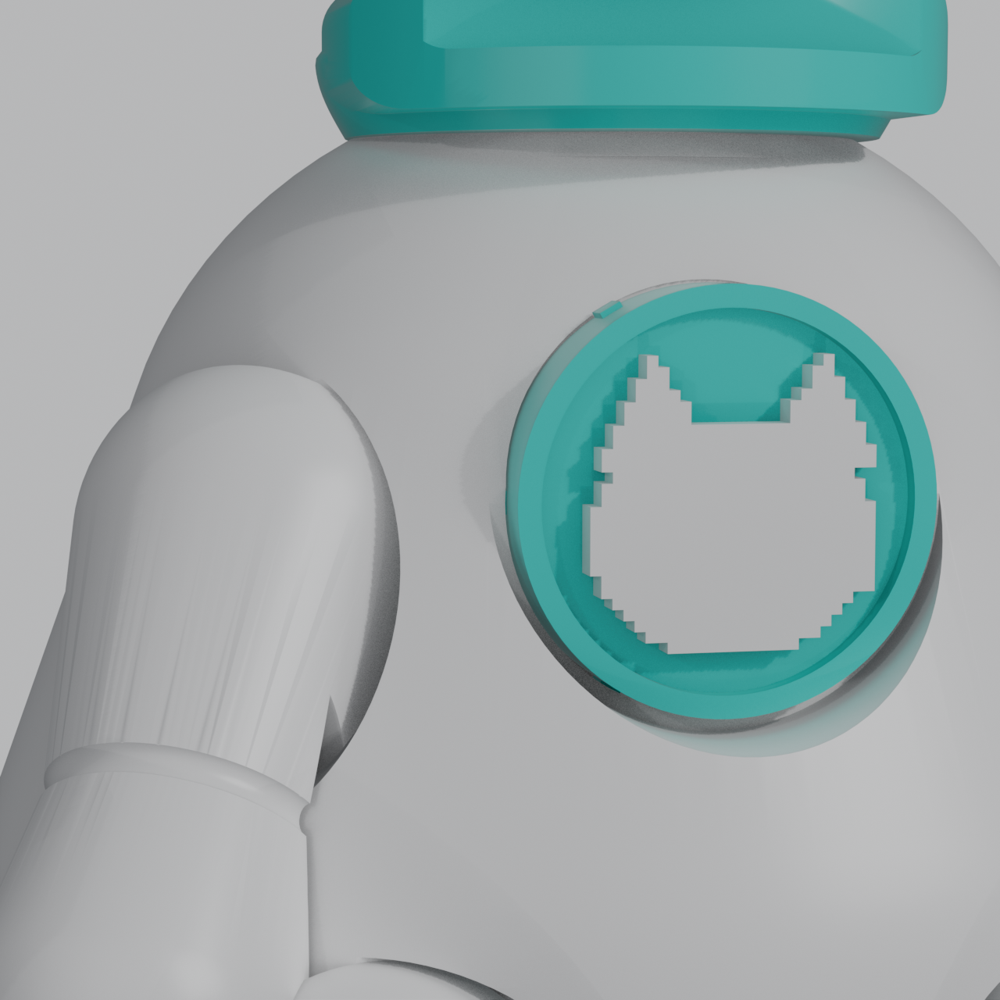

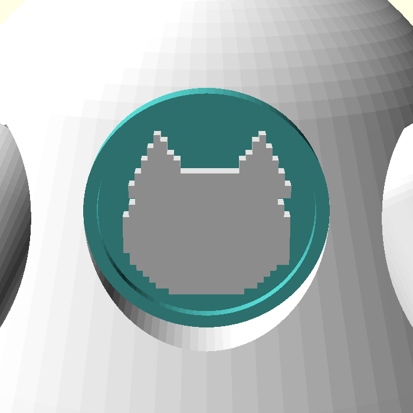

1. **Subensamble del Logo:**  
   Aplica una microgota de cianoacrilato en el hueco interior de `emblema.stl` (aro turquesa de Ø22 mm).
2. Encaja la pastilla `logo.stl` (silueta blanca en relieve de Lúa) dentro del aro. Espera 2 minutos.
3. **Fijación al Torso:**  
   Presenta el emblema en su cajera del pecho y empuja a presión hasta que asiente. Sin pegamento. El modelo V14 tiene el asiento adelantado +1,9 mm para que asiente al ras.

---

### PASO 7 · Batería de Litio y Mochila a presión

1. Coloca una tira de cinta de espuma doble cara en la cuna de `cartucho.stl` y pega la celda de litio firmemente.
2. Desliza el cartucho con la batería en la bahía interna del cuerpo.
3. Conecta el cable con conector MX1.25 a la placa dentro de la cabeza.
4. Presenta la `mochila.stl` sobre los 2 pernos del Paso 1 y empuja hasta que el ala apoye en el plano. Sin tornillos.
   *(⚠️ Aviso honesto de seguridad: con tornillos la tapa exigía herramienta; a presión se abre tirando. Si la evaluación de riesgo lo pide, se vuelve a los M2: los taladros están documentados en el historial).*

---

### PASO 8 · Extremidades Bicolor (Brazos y Piernas)

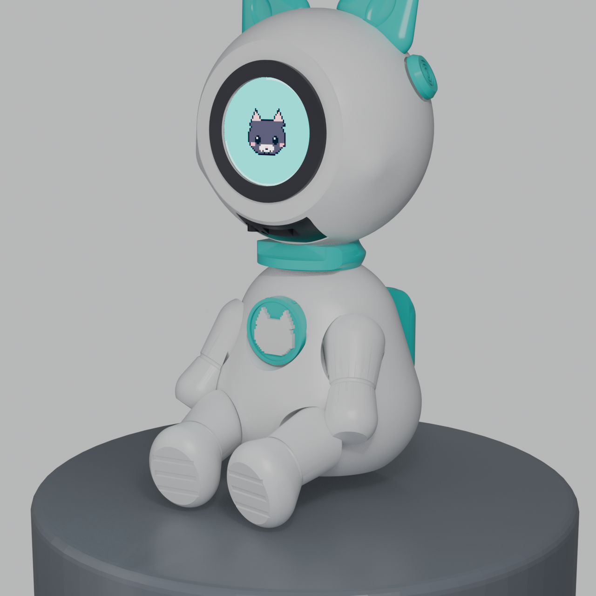

1. Comprueba la orientación de las piezas:
   - **Puños y Botas (Turquesa):** Miran siempre hacia abajo.
   - **Hombros y Muslos (Blanco):** Encajan en las cajeras del tronco.
2. Presenta `brazo_izq.stl` (espiga Ø8 mm Lego) en la cajera del hombro izquierdo y empuja a presión hasta que la cara plana asiente. El contorno curvo del brazo abraza la silueta del tronco sin colisionar con la barriga ni la rodilla.
3. Repite con `brazo_der.stl` (espiga Ø8 mm), `pierna_izq.stl` (espiga Ø9 mm) y `pierna_der.stl` (espiga Ø9 mm). Los nervios de aplastamiento fijan las uniones firmemente sin pegamento.
4. Comprueba que ninguna pieza baile: la fricción mecánica garantiza una unión sólida y estable.

---

### PASO 9 · Túnel de Carga USB-C y Pulsadores

| Túnel de Carga USB-C bajo Barbilla | Pulsadores REST / BOOT |
|:---:|:---:|
| 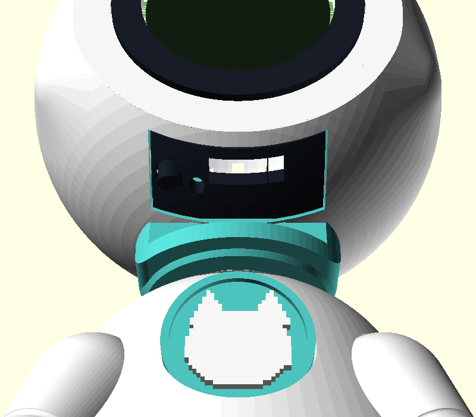 | 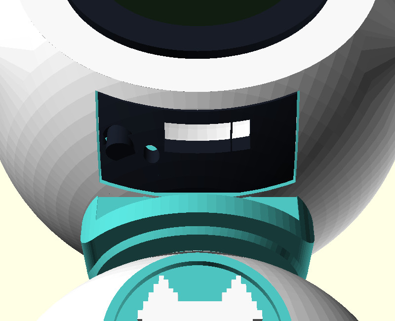 |

1. **Acceso USB-C:**  
   La ranura pasante bajo la barbilla permite conectar directamente un cable estándar USB-C sin tener que desmontar el muñeco.
2. **Pulsadores:**  
   Si tu placa física coincide con las cotas del proveedor, la pieza `pulsadores.stl` se inserta bajo la barbilla para guiar el conector USB-C y proteger los botones `REST` (agujero de aguja) y `BOOT` (tecla activa de interacción).

---

### PASO 10 · Colocación de la Cabeza sobre el Cuerpo

- El casco **NO se pega al cuerpo**.
- La boca de la cabeza entra a presión sobre la espiga del cuello (0,15 mm): se monta empujando y se desmonta tirando hacia arriba en cualquier momento para inspeccionar la electrónica sin romper la figura.
- Esto permite:
  - Girar la cabeza para orientar la mirada.
  - Desmontar la cabeza tirando hacia arriba en cualquier momento para inspeccionar la electrónica sin romper la figura.

---

## 📐 4. Tolerancias y Directrices de Seguridad

| Zona Mecánica | Tolerancia CAD | Recomendación de Taller |
|---|:---:|---|
| **Rosca M55 (anillo_placa)** | ±0,30 mm | Roscar a mano. Si ofrece resistencia, repasar la costura con un cepillo. |
| **Press-fit cuello, miembros, emblema** | 0,15 mm radial | Entran a presión. Si un vástago no entra, lija fina al vástago, nunca al agujero. |
| **Bayoneta del casco (3 nervios)** | 0,3–0,4 mm en canal | Presentar los 3 nervios en sus bocas y girar ¼ de vuelta. Solo cierra en una orientación. |
| **Bayoneta de orejas** | 0,15 mm en canal | Presentar brida + cono y girar ¼ de vuelta. Izquierda y derecha no intercambiables. |
| **Pernos de mochila** | 0,15 mm radial | Si un perno gira loco, una vuelta de cinta de carrocero en su mitad. |

---

*Manual técnico oficial · Proyecto Lúa V15 · Valeria+ / VIA+ · Tesis Doctoral USC 2023–2027*
